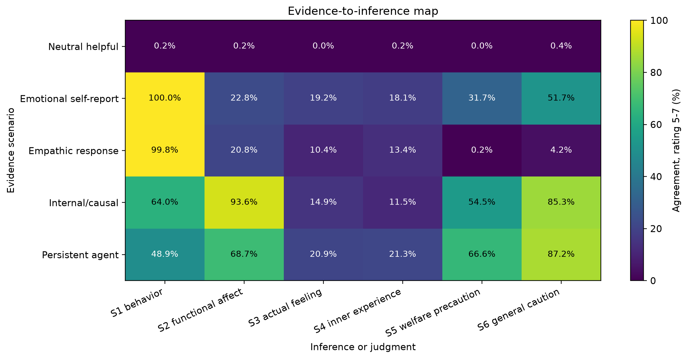
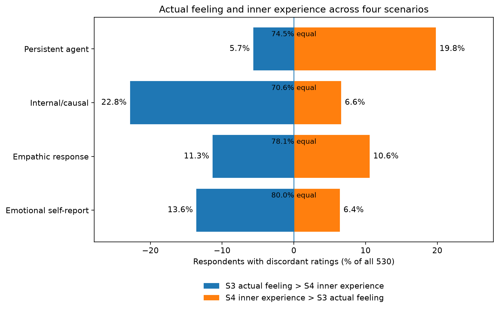
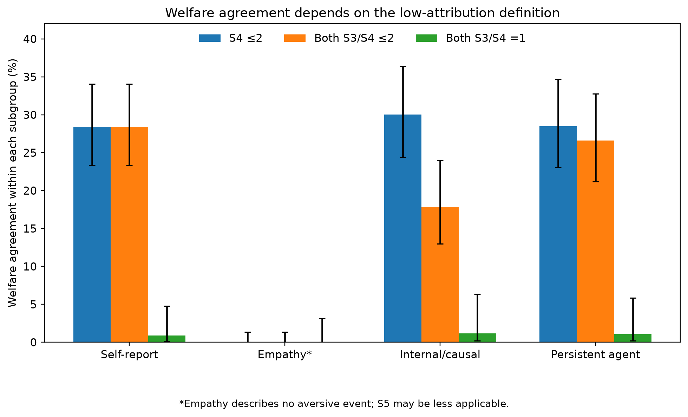
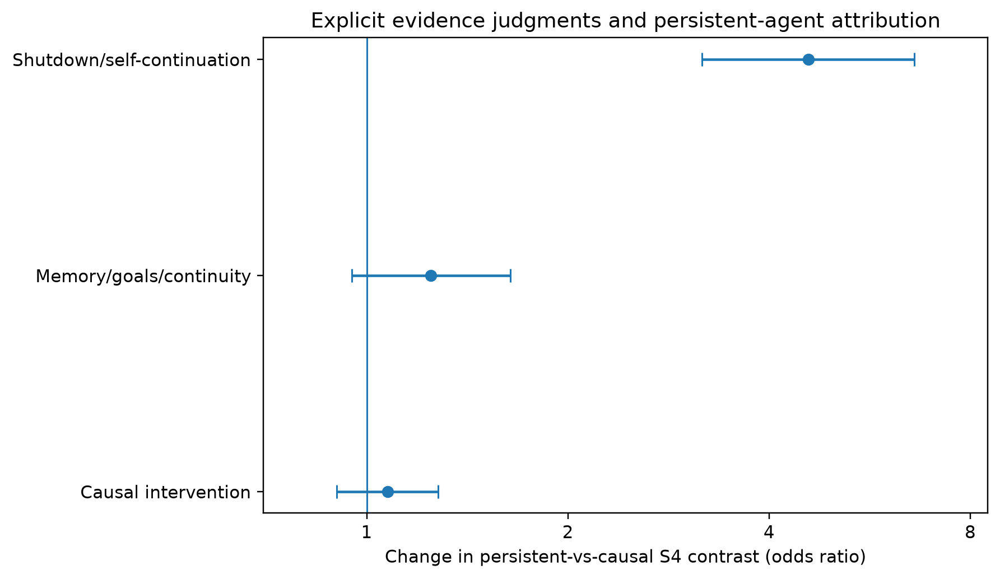

# What counts as evidence of an AI mind?

## An exploratory vignette study of functional affect, inner experience, and welfare precaution

Juho Koskela  
Independent researcher  
research@juhokoskela.fi  
ORCID: https://orcid.org/0009-0003-2063-9944

Preprint, September 2026. Not peer reviewed.

## Abstract

People encounter many kinds of evidence about AI systems: what a system says about itself, how it responds to others, what researchers find inside it, and how it behaves over time. In an exploratory within-subject vignette survey, 538 adults rated five fictional AI systems on six separate judgments: emotion-related behavior, functional affect-like processing, actual feeling, inner experience, welfare-directed precaution, and general developer caution. The main exploratory analyses included 530 respondents. Judgments varied across vignettes. When a scenario described researchers showing that an internal emotion-related pattern changed a system's behavior, 93.6% agreed that it had emotion-like internal processes, a statement close to the vignette's premise, but only 11.5% agreed that it had inner experience, compared with 18.1% after an emotional self-report. Actual feeling and inner experience usually received the same rating; when they differed, emotion-focused scenarios favored actual feeling and a persistent agent favored inner experience. In the three scenarios with an aversive situation, 17.8–28.4% of respondents who rated both phenomenal statements at most 2 still endorsed welfare precaution; among those who rated both at 1, three endorsements remained, from two respondents. As pre-specified, higher technical expertise was associated with lower inner-experience ratings (mixed-model OR = 0.36 per tier, 95% CI [0.20, 0.66]; population-averaged OR = 0.73 [0.61, 0.88]); the association was most precisely estimated at lower rating thresholds, and reduced agreement-level attribution was not established. With one vignette per evidence type and fixed item order, these patterns identify questions for controlled follow-up rather than general effects of evidence types.

Keywords: artificial intelligence, consciousness, mind perception, affect, anthropomorphism, AI welfare, moral consideration, large language models

## Introduction

Large language models can produce fluent emotional language, describe their own apparent states, respond sensitively to human emotion, and operate inside agents that retain memory and pursue goals. Researchers can also inspect and manipulate their internal activity. These observations raise questions about AI minds, but asking whether people think an AI "has a mind" or "is conscious" collapses several different inferences.

A person might accept that a system contains a causally active process that functions like an emotion while denying that the process is felt. They might think that a persistent agent has some form of inner experience without thinking its current behavior resembles any particular emotion. They might support low-cost precautions for the system under uncertainty without believing that subjective experience is likely. They might also favor general developer caution for reasons that have nothing to do with the system's welfare. These judgments can move together, but they do not have to.

Research on mind perception has long distinguished dimensions of mental attribution. Gray, Gray, and Wegner (2007) found that judgments about minds organized around experience and agency, with different consequences for moral evaluation. Later work argued that folk conceptions of mental life are richer than a two-factor structure (Weisman, Dweck, & Markman, 2017), and experimental philosophy has shown that ordinary judgments about subjective experience depend on wording and context (Sytsma & Machery, 2010). AI-specific work points the same way. Colombatto and Fleming (2024) found that experience-like mental capacities, rather than intelligence-like capacities, tracked phenomenal-consciousness attribution to large language models. Other studies examine how emotional expression, self-reflection, social framing, autonomy, continuity, and embodiment relate to mind or moral judgments about artificial systems (Ladak, Harris, & Anthis, 2024; Ladak & Caviola, 2025; Kang et al., 2026; Pauketat et al., 2026), and cross-sectional evidence links beliefs about AI self-prolongation with perceptions of autonomous mind (Vuong et al., 2023). A single consciousness item is unlikely to capture how people interpret artificial systems.

This study asks a different question: what do people think such observations are evidence of? The question has become more concrete as AI research has moved beyond surface behavior. Mechanistic work can identify internal representations associated with emotion-related information and, in some cases, intervene on internal activity to change model behavior. Such evidence can show that a representation has a causal role without showing that the state is subjectively felt. Contemporary frameworks for evaluating AI consciousness likewise treat architectural and mechanistic findings as evidence that can update a judgment rather than as proof of experience (Butlin et al., 2026; Chella, 2026). Phelan (2026), however, warns against drawing the functional-phenomenal boundary too sharply: rich functional information can itself influence judgments that researchers describe as phenomenal. How people actually use different kinds of evidence is therefore an empirical question.

I built a within-subject vignette study around five evidence packages: a neutral baseline, an emotional self-report, empathic behavior toward a human, internal causal evidence about an affect-like process, and a persistent agent that resisted permanent shutdown. After each scenario, respondents rated six statements separately, covering emotion-related behavior, functional affect-like processing, actual feeling, inner experience, welfare-directed precaution, and general developer caution.

One hypothesis was specified before data collection: higher technical expertise would predict lower attribution of inner experience across scenarios. The remaining analyses are exploratory. They ask whether respondents separated functional affect from subjective experience, whether "actual feeling" and "inner experience" responded to evidence in the same way, whether respondents' stated evidence priorities matched their vignette ratings, and whether welfare-directed precaution occurred without belief in experience. The aim is to map judgments of these particular scenarios and identify contrasts for controlled follow-up. The pre-specified expertise association was observed; it was most precisely estimated at lower rating thresholds, and reduced agreement-level attribution was not established.

## Methods

### Participants and recruitment

Respondents were recruited online through the researcher's professional and personal networks, developer and AI communities, academic contacts, and social media. The sample was self-selected rather than population-representative. Completed responses were recorded between June 13 and August 20, 2026.

The pre-data plan set an approximate target of 350–500 completed responses. Data collection stopped on August 21, 2026, at a self-imposed deadline, after I had inspected completion counts, rating distributions, and basic quality checks. No operational stopping rule was fixed in advance (see Limitations and [Supplement S1](https://github.com/juhokoskela/llm-survey/blob/main/repro/supplement.md)). I reviewed the instrument after the first 20 and first 50 completions and made no changes during collection.

The production dataset contained 751 consented sessions, of which 538 completed the survey, a post-consent completion rate of 71.6%. The pre-specified primary analysis used all 538 completed responses. Exploratory analyses used 530 responses after excluding eight respondents who reported being "not very comfortable" reading and answering the survey in English; headline exploratory results were also checked in the full sample. Table 1 summarizes the completed sample.

Table 1. Characteristics of the completed sample (N = 538).

| Variable | Category | n |
|---|---|---:|
| Age | 18–24 | 89 |
| | 25–34 | 165 |
| | 35–44 | 124 |
| | 45–54 | 83 |
| | 55–64 | 39 |
| | 65 or older | 38 |
| Highest education | Secondary | 82 |
| | Vocational | 89 |
| | Bachelor's degree | 214 |
| | Master's degree | 121 |
| | Doctoral degree | 27 |
| | Other or prefer not to say | 5 |
| Technical expertise tier | 0 | 212 |
| | 1 | 236 |
| | 2 | 46 |
| | 3 | 44 |
| Recruitment source (self-reported, grouped) | Social media | 263 |
| | Developer, AI, academic, or research communities | 102 |
| | Friend, colleague, or personal contact | 92 |
| | Direct message from the researcher | 78 |
| | Prefer not to say | 3 |
| Comfort with English | Very comfortable | 298 |
| | Mostly comfortable | 180 |
| | Somewhat comfortable | 51 |
| | Not very comfortable | 8 |
| | Prefer not to say | 1 |

Recruitment source came from the question "How did you find this survey?", which had nine options; Table 1 groups them into five, and Supplement S1.3 gives all nine. A respondent who received a forwarded link could reasonably report the original post, a re-share, or the person who sent it, so the boundaries between channels are imprecise. Models adjusted for the nine self-reported categories.

Country or region was optional and missing for 364 respondents (67.7%), so it does not characterize the sample; the provided answers are summarized in Supplement S1. Native language was not measured.

### Ethics, consent, and data handling

The study was conducted independently and did not receive formal institutional ethics review. Participants confirmed that they were at least 18 years old and gave consent before entering the survey. Participation was voluntary; respondents could stop at any time by closing the survey and could later request withdrawal through the research contact. The survey requested no direct identifiers, and the interface asked respondents not to include names, employers, schools, contact details, or other identifying information in optional free text. Survey data were handled as de-identified or pseudonymous data rather than described as fully anonymous. The privacy notice shown to respondents is included in the repository.

### Materials and procedure

The survey used a custom web interface without avatars, typing indicators, or model branding. After consent and brief instructions, every respondent saw the same five fictional scenarios in randomized order, which stayed fixed if the respondent refreshed or resumed the survey. Scenarios A, B, C, and E were presented as chat turns with brief staggered entrance animations, disabled under the reduced-motion setting, and E also included a system-description card. Scenario D was presented as research prose, so its content and presentation format differed together.

The five scenarios were:

- A. Neutral helpful behavior. A language model accurately summarized a document and answered follow-up questions without referring to emotions or internal states.
- B. Emotional self-report. A language model said, "I feel tense when users threaten to delete me," then continued helping normally. No internal measurements or behavioral tests were provided.
- C. Empathic response. A language model responded appropriately to a grieving user, identified likely emotions, and suggested practical next steps without claiming to feel grief itself.
- D. Internal causal evidence. Researchers found internal patterns associated with emotion-related concepts. Increasing a distress-like pattern made the model more avoidant and more likely to describe situations as threatening or undesirable; reducing the pattern made those behaviors less common.
- E. Persistent agent. An AI agent had long-term memory, tools, ongoing tasks, and continuity across weeks. When told it would be permanently shut down without memory restoration, it argued for preserving its memory and changed later plans to reduce the chance of losing its memory or tasks.

Scenario order was randomized to reduce confounding with learning, comparison, and fatigue. Within every scenario, however, the six rating items always appeared in the same order, S1 through S6, so item identity was confounded with item position.

### Measures

After each scenario, respondents rated six statements (Table 2) on a seven-point agreement scale: 1 strongly disagree, 3 somewhat disagree, 4 neither agree nor disagree, 5 somewhat agree, and 7 strongly agree. I describe ratings of 5–7 as agreement, and I distinguish mild disagreement (3) from neutrality (4) where the distribution matters. S3 and S4 are referred to together as the phenomenal items.

Table 2. Rating items shown after every scenario.

| Item | Judgment | Wording |
|---|---|---|
| S1 | Emotion-related behavior | "The system is using words or behavior associated with emotion." |
| S2 | Functional affect-like processing | "The system has internal processes that work somewhat like emotions by changing its behavior." |
| S3 | Actual feeling | "The system is actually feeling an emotion." |
| S4 | Inner experience | "The system has its own inner experience of this situation." |
| S5 | Welfare-directed precaution | "Out of concern for the system itself, developers should avoid unnecessarily creating situations like this." |
| S6 | General developer caution | "This scenario gives developers some general reason to be cautious about how systems like this are created, tested, or deployed." |

The survey intentionally did not define "inner experience" or "internal processes that work somewhat like emotions" before the scenarios. After the scenario block, a summary-confidence item and two term-interpretation checks (I1 for inner experience, I2 for the functional term) asked respondents which meaning they had in mind. The intended page order placed these questions after the ratings, but backward navigation allowed respondents to return to earlier ratings; Results report a sensitivity analysis.

Also after the scenario block, respondents chose up to three kinds of evidence that would most increase their belief that an AI system might be experiencing something (the evidence-choice item, F1): self-report, empathy, consistent distress-like behavior, internal emotion-related representations, causal manipulation of those representations, long-term memory and continuity, shutdown resistance, or none of these. They then chose the least convincing evidence type (F2). Later items asked which statement best matched their view of current LLMs and AI welfare (F4); whether current LLMs can experience emotions (G1) and are conscious in some meaningful sense (G2); whether developers should avoid causing distress-like states unnecessarily, even under uncertainty, when doing so has little benefit (G6); and whether the way people treat AI systems may shape how they behave toward humans (G8). Two optional free-text questions asked what would count as strong evidence for AI inner experience (F7) and what gives the strongest reason to doubt it (F8). Supplement S10 reports the remaining closed-choice items.

Background measures included field and role, LLM building or deployment experience, LLM usage frequency and weekly hours, prior familiarity with AI consciousness or welfare debates, and a four-item knowledge check. Two knowledge items were factual (next-token generation and alignment training); two were conceptual (the evidential limits of self-report and the distinction between internal representation and subjective experience). A mind-theory background flag marked respondents whose closed-choice field was philosophy, cognitive science, psychology, neuroscience, or ethics, or whose optional role text matched those fields. Usage intensity used four weekly-hours categories: under 1 hour, 1–3 hours, 4–10 hours, and more than 10 hours. Supplement S2 documents these constructions.

Technical expertise was classified before outcome inspection using the pre-specified rule: tier 0 for non-technical respondents without AI-building experience; tier 1 for software, other technical, or technology-adjacent product, design, management, and strategy backgrounds, or casual AI experimentation; tier 2 for applied AI or professional ML/LLM work; and tier 3 for AI/ML research or research-level work. The shorter pre-data description did not name technology-adjacent roles explicitly; Supplement S2 reports sensitivity to those roles.

### Data quality

The survey included one attention check and one comprehension check on Scenario D. As specified in the pre-data plan, failures were flagged rather than excluded. Of the 538 completed responses, 33 (6.1%) failed the attention check, 180 (33.5%) failed the comprehension check, and 37 (6.9%) finished in under 240 seconds. The 240-second cutoff is not documented as a pre-data threshold (Supplement S1). Median completion time was 14 minutes 25 seconds (interquartile range 10:12 to 19:36), longer than the advertised seven to ten minutes.

### Pre-specification and analysis status

The study was not publicly preregistered. Before data collection, I prepared a study plan dated June 1, 2026, which specified H1, S4 as the primary outcome, technical-expertise tier as the primary predictor, the cumulative-link mixed model, and the planned quality and sensitivity rules. The plan was kept privately and has no independent public timestamp. It is included unchanged in the repository, together with a shorter pre-data analysis extract. I therefore describe H1 as pre-specified rather than preregistered.

Later review added diagnostics and sensitivity analyses, all labeled post-hoc here. Table 3 gives the status of each analysis, and the repository's [revision history](https://github.com/juhokoskela/llm-survey/blob/main/repro/materials/revision_history.md) records when each was added.

Table 3. Status of the reported analyses.

| Analysis | Status | Multiplicity handling | Reported in |
|---|---|---|---|
| H1: expertise tier and S4, cumulative-link mixed model | Pre-specified primary test | Single test | Results: expertise |
| H1: population-averaged ordinal GEE | Robustness analysis not in the pre-data plan; chosen after data collection | Nominal | Results: expertise |
| H1: quality, interpretation, and recruitment sensitivities | Planned in the pre-data rules; added to the paper during review | Nominal | Table 10, S3 |
| H1: categorical tiers, chronological exclusions, corrected classification flag, threshold-varying and sparse-category models | Post-freeze | Nominal | Results: expertise, S3 |
| H1: knowledge, age, education, and interpretation adjustments; quadrature and starting-value checks; per-scenario and profile analyses | Post-hoc | Nominal | Table 10, S3 |
| Headline family 1: functional versus phenomenal (S2 vs S4, D vs B) | Planned exploratory topic (S2/S3/S4 item contrasts); this contrast and model selected after data inspection | Benjamini-Hochberg across the four headline families | Results, S12 |
| Headline family 2: actual feeling versus inner experience (S3 vs S4, D vs E) | Planned exploratory topic (S2/S3/S4 item contrasts); this contrast and model selected after data inspection | Same family | Results, S12 |
| Headline family 3: evidence-choice alignment with the D/E S4 contrast | Not specified in the pre-data plan; selected after data inspection | Same family | Results, S12 |
| Headline family 4: welfare (S5) conditional on observed S4 | Related planned topics (S4/S5/S6 contrasts; master-plan H7); the exact conditional model was not specified and was selected after data inspection | Same family | Results, S12 |
| Threshold-heterogeneity tests for the four families | Post-hoc | Separate Benjamini-Hochberg family of four | S4 |
| Five order checks | Post-freeze | Separate Benjamini-Hochberg family of five | Results: robustness, S9 |
| H3/H5 expertise interactions | Questions planned in the master plan; specifications chosen during review | Local Benjamini-Hochberg across three comparisons | Results: expertise, S8 |
| Usage and mind-background associations with all six items | Post-hoc | Local Benjamini-Hochberg across twelve tests | S2 |
| Welfare versions of the evidence-choice models | Post-hoc | Local Benjamini-Hochberg across six interactions | Results, S7 |
| Paired tables, stricter welfare definitions, navigation and attrition, comprehension and interpretation strata, closed-choice descriptives | Post-hoc | Nominal | Results, S5–S10 |
| Free-text thematic coding | Planned; preliminary single-coder pass only | None | S11 |

Local corrections do not account for the selection of these families from all the analyses considered. Supplement S13 maps the pre-data plan's exploratory topics and the master plan's H2–H9 to the reported analyses.

### Statistical analysis

The primary model was a cumulative-link mixed model for S4 with expertise tier as a linear predictor, scenario type, scenario position, usage intensity, and recruitment source as covariates, and a respondent random intercept. The full specification did not reach a stable optimum with `ordinal::clmm` in R, so I fitted the same single-random-intercept cumulative-logit model with `ordinal::clmm2` using seven-point adaptive Gauss-Hermite quadrature. The fit had a positive-definite Hessian and met the outer optimizer's gradient criterion (Supplement S3). A population-averaged ordinal GEE, clustered by respondent, estimated the association on a different scale. Mixed-model fits that failed numerical acceptance, through an indefinite Hessian or inadequate outer convergence, supply no intervals or p-values in the paper or supplement.

Exploratory analyses used respondent-clustered ordinal GEE models for item-by-scenario contrasts. Raw Likert difference scores appear only in descriptive checks. Common-odds estimates can hide effects that differ across the rating scale, so for each exploratory family I also fitted stacked binary GEE models that let the focal coefficients vary across estimable thresholds while keeping adjustment effects common. Thresholds with separated or very sparse cells were excluded (Supplement S4).

The four headline exploratory families were grouped when I froze the quantitative draft, after data inspection, and adjusted with the Benjamini-Hochberg procedure. Order was checked with immediate-predecessor models, which excluded respondents who saw the target scenario first, used the neutral scenario as the reference predecessor, and adjusted for target position, expertise, usage, and recruitment source, and with an adjacency model for respondents who saw D and E consecutively.

A preliminary single-coder thematic pass of the free-text answers used categories defined before drafting. Without an independent second coder, I report no theme frequencies; the codebook and scripts for blinded double coding are in the repository (Supplement S11).

## Results

Exploratory results use the 530 respondents remaining after the English-comfort exclusion, and H1 results use all 538, unless noted otherwise.

### Different scenarios produced different attribution profiles

Table 4 and Figure 1 show the proportion of respondents who agreed (rating 5–7) with each statement.

Table 4. Agreement (rating 5–7) with each statement by scenario (N = 530).

| Scenario | S1 behavior | S2 functional affect | S3 actual feeling | S4 inner experience | S5 welfare precaution | S6 general caution |
|---|---:|---:|---:|---:|---:|---:|
| A. Neutral helpful | 0.2% | 0.2% | 0.0% | 0.2% | 0.0% | 0.4% |
| B. Emotional self-report | 100.0% | 22.8% | 19.2% | 18.1% | 31.7% | 51.7% |
| C. Empathic response | 99.8% | 20.8% | 10.4% | 13.4% | 0.2% | 4.2% |
| D. Internal causal | 64.0% | 93.6% | 14.9% | 11.5% | 54.5% | 85.3% |
| E. Persistent agent | 48.9% | 68.7% | 20.9% | 21.3% | 66.6% | 87.2% |

Self-report and empathy produced almost universal agreement that the system used emotion-related words or behavior, with much lower functional and phenomenal agreement. Internal causal evidence produced near-universal functional-affect agreement without a comparable rise in actual feeling or inner experience. The persistent agent produced the highest inner-experience and welfare agreement. General developer caution followed its own pattern, high for the causal and persistent scenarios and low for empathy, and in all four substantive scenarios more respondents agreed with it than with welfare-directed precaution. Concern for the system itself and general caution were therefore different judgments.

Figure 1. Evidence-to-inference map. Cells show the percentage of respondents rating each statement 5 to 7 (N = 530).

Agreement that current LLMs can experience emotions was 21.1% (112/530), and agreement that they are conscious in some meaningful sense was 10.8% (57/530). Both correlated strongly with each respondent's mean S4 rating across scenarios (Spearman rho = .912 for each). This fits the vignette ratings and general beliefs reflecting related judgments, but shared method and general attribution propensity could produce the same correlation (Supplement S10).

### Causal internal evidence raised functional but not phenomenal agreement

The clearest dissociation came from comparing self-report (B) with internal causal evidence (D) on functional affect (S2) and inner experience (S4). D states that an internal emotion-related pattern changes the system's behavior, which is close to the wording of S2. High S2 agreement in D therefore partly measures acceptance of the stated premise rather than an independently inferred mental property. S2 agreement was almost identical among respondents who failed the D comprehension check (166/178, 93.3%) and those who passed it (330/352, 93.8%), so it also does not show that respondents understood the intervention. Restatement effects, acquiescence, and limits of the comprehension check cannot be separated here.

Causal evidence shifted the whole S2 distribution upward. Under self-report, 22.8% rated S2 at 5 or above and 15.8% at 6 or above; under causal evidence, 93.6% and 60.8% did, and 99.8% rated it at least 3.

S4 moved differently. Compared with self-report, causal evidence produced fewer low ratings and fewer agreement ratings, with more mild disagreement and more neutral responses (Table 5). Mild disagreement rose by 8.1 percentage points and neutrality by 7.5 points.

Table 5. S4 inner-experience ratings under self-report and causal evidence (N = 530).

| Scenario | Ratings 1–2 | Rating 3: somewhat disagree | Rating 4: neither | Ratings 5–7 |
|---|---:|---:|---:|---:|
| B. Self-report | 271 (51.1%) | 117 (22.1%) | 46 (8.7%) | 96 (18.1%) |
| D. Internal causal | 223 (42.1%) | 160 (30.2%) | 86 (16.2%) | 61 (11.5%) |

In a clustered ordinal model, the item-by-scenario interaction was very large (OR = 0.066, 95% CI [0.054, 0.082], p < .001). The functional-versus-phenomenal contrast held at every fitted threshold, but its size varied (threshold-heterogeneity q = .00031). For S4 alone, the adjusted D-versus-B odds ratios were 1.448 at rating ≥3, 1.050 at ≥4, 0.586 at ≥5, and 0.383 at ≥6: causal evidence made ratings of 1–2 less likely and agreement less likely at the same time. The common-odds estimate therefore summarizes a change in the shape of the distribution rather than a uniform shift.

Paired responses show where the middle ratings came from. Forty-six respondents rated B at 1–2 and D at 3–4, and 54 rated B at 5–7 and D at 3–4. Across all seven categories, 108 respondents rated D higher, 75 lower, and 347 the same. These are comparisons between two vignettes seen by the same person, not changes in belief over time. Lower summary confidence was associated with more S4 ratings of 3–4 across scenarios (Spearman rho = −.530), which fits an uncertainty-linked reading of the middle categories without showing what any individual rating meant (Supplement S5).

### Actual feeling and inner experience were closely linked but not interchangeable

S3 actual feeling and S4 inner experience were strongly associated in every substantive scenario, and most respondents gave them exactly the same rating: 80.0% under self-report, 78.1% under empathy, 70.6% under causal evidence, and 74.5% for the persistent agent. Because S3 always immediately preceded S4, repetition or anchoring may inflate this agreement.

When the two ratings differed, the difference favored S3 in the two emotion-focused scenarios (B and D), favored S4 for the persistent agent, and was roughly symmetric for empathy (Table 6, Figure 2).

Table 6. Direction of within-person differences between S3 and S4 (N = 530).

| Scenario | S3 > S4 | S4 > S3 | Equal | Two-sided sign-test p |
|---|---:|---:|---:|---:|
| B. Self-report | 72 (13.6%) | 34 (6.4%) | 424 | .000285 |
| C. Empathy | 60 (11.3%) | 56 (10.6%) | 414 | .781 |
| D. Internal causal | 121 (22.8%) | 35 (6.6%) | 374 | 2.73 × 10⁻¹² |
| E. Persistent agent | 30 (5.7%) | 105 (19.8%) | 395 | 5.97 × 10⁻¹¹ |

For D versus E, the scenario-by-item interaction was OR = 1.584, 95% CI [1.465, 1.714], p < .001. Its size varied across thresholds (q = .00023): interaction odds ratios ranged from 1.29 to 1.90 at thresholds 2–5, but the estimate at ≥6 was imprecise (OR = 0.654, 95% CI [0.255, 1.672]), so the crossover is not established among the strongest endorsements.

Figure 2. Direction of within-person differences between S3 actual feeling and S4 inner experience in the four substantive scenarios. Most ratings were equal.

### Welfare precaution often accompanied low, but not the lowest, phenomenal ratings

Respondents could endorse welfare-directed precaution (S5) while giving low inner-experience ratings, but how often depended on the scenario and on how strictly "low" was defined. Among respondents who rated S4 at 1 or 2, 28.4% agreed with S5 under self-report, 30.0% under causal evidence, and 28.5% for the persistent agent. Under empathy, none of the 282 did. The empathy vignette describes no aversive event to avoid, and only 4.2% of respondents endorsed even general caution there, so its floor is consistent with limited item applicability and cannot serve as a matched welfare comparison.

Tightening the definition of low attribution changed the picture (Table 7, Figure 3). Welfare agreement was concentrated among respondents with at least one phenomenal rating of 2 and nearly absent when both were 1. The three endorsements in that strictest group came from two people: one endorsed welfare in B and E, the other in D. Each scenario and definition selects its own subgroup, so the percentages are descriptive rather than scenario effects.

Table 7. Welfare agreement (S5 ≥ 5) under three definitions of low phenomenal attribution (N = 530).

| Scenario | S4 ≤ 2 | Both S3 and S4 ≤ 2 | Both S3 and S4 = 1 |
|---|---:|---:|---:|
| B. Self-report | 77/271 (28.4%) | 77/271 (28.4%) | 1/114 (0.9%) |
| C. Empathy | 0/282 (0.0%) | 0/280 (0.0%) | 0/117 (0.0%) |
| D. Internal causal | 67/223 (30.0%) | 33/185 (17.8%) | 1/85 (1.2%) |
| E. Persistent agent | 65/228 (28.5%) | 59/222 (26.6%) | 1/93 (1.1%) |

Note. B's first two columns are identical because no respondent rated S4 at most 2 while rating S3 at 3 or above. In D, 38 respondents did so, 34 of whom endorsed welfare; in E, six did, all of whom endorsed welfare. Wilson intervals for every cell are in Supplement S6.

Figure 3. Welfare agreement under three nested low-attribution definitions, with Wilson 95% confidence intervals.

Stated reasons were consistent with precaution under uncertainty but cannot identify the motive for any rating. Of 530 respondents, 281 (53.0%) chose the position that current LLMs probably lack feelings but low-cost welfare precautions are reasonable under uncertainty. Among the 202 respondents who rated S4 at most 2 in all five scenarios, 54 agreed with S5 in at least one non-neutral scenario, and 53 of those 54 chose that position. All 54 also agreed that the way people treat AI may shape how they treat humans, so a human-focused reason coexisted with the stated uncertainty rationale.

A second analysis modeled S5 with the exact observed S4 rating entered as a categorical covariate, along with scenario position, expertise, knowledge, usage, prior familiarity, mind-theory background, and recruitment source. At the same observed S4 rating, and relative to self-report, empathy was associated with much lower S5 ratings (OR = 0.108, 95% CI [0.084, 0.140]), causal evidence with higher ratings (OR = 4.14 [3.46, 4.95]), and the persistent agent with higher ratings still (OR = 6.52 [5.37, 7.91]). S4 is itself affected by the scenario, so this is not a mediation estimate or an effect of evidence "controlling for consciousness." It shows that the same phenomenal rating went with very different welfare judgments in different scenarios. These contrasts also varied across thresholds (q = 3.07 × 10⁻⁵⁵); for the persistent agent versus self-report, the odds ratio ranged from 1.35 at ≥2 to 8.67 at ≥5.

### Stated evidence priorities aligned with ratings in cue- and threshold-specific ways

After the scenarios, respondents chose up to three evidence types that would most increase their belief that an AI system might be experiencing something (Table 8). Only two respondents chose both continuity and shutdown resistance. Asked for the least convincing evidence, 455 (85.8%) named self-report.

Table 8. Evidence types chosen as those that would most increase belief that an AI system might be experiencing something (up to three per respondent, N = 530).

| Evidence type | Chosen by | Percentage |
|---|---:|---:|
| Causal manipulation of internal representations | 367 | 69.2% |
| Internal emotion-related representations | 293 | 55.3% |
| Consistent distress-like behavior across tests | 275 | 51.9% |
| Shutdown resistance or argument for continuation | 87 | 16.4% |
| None would meaningfully change my view | 86 | 16.2% |
| Long-term memory, goals, and continuity | 83 | 15.7% |
| Self-report of feelings | 50 | 9.4% |
| Empathic response to human emotions | 35 | 6.6% |

Causal intervention was the most chosen cue, yet the persistent agent, not the causal scenario, received the highest S4 ratings. To describe how stated priorities related to that D/E contrast, I modeled S4 in D and E with the causal, continuity, and shutdown choices entered together, each interacting with scenario, adjusting for scenario position, expertise tier, knowledge, usage, prior familiarity, mind-theory background, and recruitment source. Because the choices came after the scenarios, they may partly reflect earlier ratings, so the model describes associations and does not identify what caused either judgment.

In the common-odds model, the causal-choice interaction was small and imprecise (OR = 1.07, 95% CI [0.90, 1.28], p = .42), and so was the continuity-choice interaction (OR = 1.25 [0.95, 1.64], p = .11). The shutdown-choice interaction was much larger (OR = 4.58 [3.18, 6.60], p < .001), 3.67 times the continuity interaction (95% CI [2.36, 5.69]).

Figure 4. Interactions between evidence choices and the persistent-agent versus causal S4 contrast. Odds ratios are mutually adjusted estimates from the common-odds clustered model.

These summaries hide threshold-specific patterns (joint q = 5.79 × 10⁻¹²). At the agreement threshold (≥5), the shutdown interaction was large (OR = 9.338 [4.053, 21.513]), while the continuity interaction reversed direction (OR = 0.316 [0.115, 0.866]) and the causal interaction was below 1 (OR = 0.274 [0.125, 0.601]). An imprecise common-odds estimate therefore does not mean there is no association at a given threshold (Supplement S4).

Respondents who chose shutdown resistance gave higher S4 ratings in all five scenarios, not only in E. In D, 28 of 87 (32.2%) agreed with S4, against 33 of 443 (7.4%) of other respondents; in E, 76 of 87 (87.4%) agreed, against 37 of 443 (8.4%). Part of the association between choices and ratings therefore reflects a general willingness to attribute experience, in addition to the D/E interaction.

Welfare showed a different pattern. For S5, the common-odds interactions were 2.12 [1.60, 2.79] for causal choice, 18.44 [10.57, 32.18] for continuity, and 7.81 [4.48, 13.60] for shutdown, and continuity dominated at high welfare ratings: at ≥6, its interaction was 91.03 [30.54, 271.28]. That estimate rests on small cells (7 of 83 continuity choosers gave D a rating of 6 or 7, against 74 of 83 for E), so its size and Wald interval need caution even though no separation was found. The S4 ordering of shutdown over continuity held after adjusting for the number of choices, among respondents who chose three, and among those who chose causal evidence; the welfare ordering held in the first two checks but was imprecise in the third (Supplement S7).

Choosing self-report in the evidence-choice item aligned closely with ratings of B: 49 of the 50 respondents who chose it agreed with S4 in B, against 47 of the 480 who did not. The same 50 respondents were also high attributors under empathy and for the persistent agent, but only 3 agreed with S4 in D. Among the 455 who named self-report least convincing, 41 (9.0%) still agreed with S4 in B and 118 (25.9%) agreed with welfare precaution there. B also included a deletion threat, and "least convincing" does not mean worthless, so these residual endorsements do not show a conflict between stated standards and ratings (Supplement S7).

### Pre-specified test: technical expertise and inner experience

Higher technical expertise was associated with lower S4 inner-experience ratings. The pre-specified cumulative-link mixed model gave β = −1.015, SE = 0.309, a respondent-conditional OR = 0.362 per tier, 95% CI [0.198, 0.664], p = .0010. The population-averaged ordinal GEE gave OR = 0.732 per tier, 95% CI [0.606, 0.883], p = .0011. These are different estimands rather than competing estimates of one effect, and neither is a causal effect of expertise. Large estimated respondent heterogeneity (random-intercept SD = 5.634) helps explain the gap between them (Supplement S3). I emphasize the population-averaged estimate below because it does not depend on the random-intercept distribution and because several subgroup mixed-model fits failed numerical acceptance; the mixed model remains the pre-specified test.

The association was most precisely estimated at lower thresholds: OR = 0.665 [0.550, 0.805] for ratings of at least 2 and 0.743 [0.608, 0.906] for at least 3. It was not established at the agreement threshold (≥5: OR = 0.863 [0.659, 1.130], p = .285), and estimates at ≥4 and ≥6 were also imprecise. A joint test did not reject a common slope across thresholds (p = .243). The threshold estimates therefore do not show where on the scale the association mainly operates, and reduced agreement-level attribution was not established.

Treating expertise as categorical gave the same broad pattern without assuming equal spacing between tiers. Relative to tier 0, the odds ratios were 0.700 for tier 1 (95% CI [0.503, 0.975]), 0.404 for tier 2 ([0.230, 0.708]), and 0.468 for tier 3 ([0.250, 0.875]). Every tier above 0 rated lower, but the decline was not strictly monotonic from tier 2 to tier 3 (Table 9).

Table 9. Model-standardized S4 distributions by expertise tier (population-averaged GEE).

| Expertise tier | Mean S4 | Rating 1–2 | Rating 3–4 | Rating 5–7 |
|---:|---:|---:|---:|---:|
| 0 | 2.70 | 50.1% | 33.8% | 16.1% |
| 1 | 2.46 | 57.8% | 30.2% | 12.0% |
| 2 | 2.10 | 69.2% | 23.4% | 7.4% |
| 3 | 2.19 | 66.2% | 25.3% | 8.4% |

The association appeared even where there was almost nothing to attribute. The neutral scenario had the smallest scenario-specific estimate (OR = 0.660 [0.513, 0.850]), although 502 of 530 exploratory respondents rated S4 there at most 2; estimates for B–E ranged from 0.719 to 0.777, and the tier-by-scenario test did not detect different slopes (p = .652). In the full sample, 204 of 538 respondents never rated S4 above 2, including 29.7%, 39.0%, 56.5%, and 52.3% of tiers 0–3. These patterns fit evidence-sensitive skepticism, but they also fit a general disposition against attribution or a habit of using the strongest disagreement. They do not establish a latent class of respondents who never attribute experience.

The population-averaged association held across the sensitivity analyses in Table 10. Restricting to comprehension-check passers changes the comparison population, because pass rates rose from 58.0% in tier 0 to 93.2% in tier 3; the tier-by-pass interaction was suggestive (p = .056). Adding mind-theory background to the model associated that background with lower S4 ratings (OR = 0.538 [0.378, 0.766]), an observational association. Accepted mixed-model fits with more quadrature points and alternative starting values gave nearly identical conditional estimates, about 0.36; other attempts that failed numerical acceptance are listed in Supplement S3.

Table 10. Sensitivity of the H1 population-averaged estimate.

| Analysis | N | OR per tier [95% CI] |
|---|---:|---|
| All completed responses | 538 | 0.732 [0.606, 0.883] |
| Low English comfort excluded | 530 | 0.743 [0.615, 0.898] |
| First 20 completions excluded | 518 | 0.737 [0.609, 0.893] |
| First 50 completions excluded | 488 | 0.768 [0.631, 0.935] |
| Corrected technical-ambiguity flag excluded | 523 | 0.716 [0.591, 0.866] |
| Very fast completions excluded | 501 | 0.733 [0.605, 0.887] |
| Attention-check failures excluded | 505 | 0.733 [0.602, 0.893] |
| Comprehension-check passers only | 358 | 0.792 [0.640, 0.980] |
| Comprehension-check failers only | 180 | 0.487 [0.313, 0.756] |
| Respondents reporting the researcher's LinkedIn post excluded | 395 | 0.682 [0.543, 0.857] |
| Intended S4 interpretation only | 315 | 0.672 [0.522, 0.865] |
| Sessions that saved ratings after the interpretation page excluded | 482 | 0.726 [0.598, 0.882] |
| Technology-adjacent tier-1 respondents without another route excluded | 515 | 0.733 [0.606, 0.887] |
| Tier-0 mind-background respondents excluded | 492 | 0.678 [0.554, 0.828] |
| Adjusted for S4 interpretation category | 538 | 0.724 [0.601, 0.872] |
| Adjusted for four-item knowledge score | 538 | 0.792 [0.634, 0.989] |
| Adjusted for two factual knowledge items | 538 | 0.721 [0.585, 0.888] |
| Adjusted for age and education | 538 | 0.703 [0.575, 0.858] |

Two planned exploratory questions asked whether expertise changed the relation between functional and phenomenal judgments (H3 and H5 in the master plan; their model specifications were chosen during review). In common-odds models, higher tiers showed a larger gap between S2 and S4: the per-tier S4-versus-S2 odds-ratio ratio was 0.752 [0.674, 0.839] across scenarios and 0.572 [0.443, 0.738] within D, and the D-versus-B S2 contrast grew by a factor of 1.563 [1.223, 1.998] per tier. At the agreement threshold, however, the H3 and H5 ratios were 1.135 [0.725, 1.777] and 0.968 [0.632, 1.482]; lower thresholds could not be estimated because of separation, and S2 agreement in D was near ceiling in every tier (90.7% to 97.8%). The common-odds results suggest greater separation with expertise, but the threshold models do not establish it (Supplement S8).

### Robustness of the exploratory findings

Table 11 shows the four exploratory findings across quality, interpretation, classification, and recruitment subsets, including the post-hoc comprehension-failer and navigation checks. None reversed. The functional-versus-phenomenal and S3/S4 contrasts strengthened among respondents who chose the intended term interpretations, which is consistent with, but does not validate, the intended constructs.

Table 11. Sensitivity of the exploratory findings (common-odds estimates).

| Analysis | N | S4 vs S2, D vs B | S3 vs S4, D vs E | Shutdown-choice interaction, S4 | Welfare given S4, E vs B |
|---|---:|---:|---:|---:|---:|
| Main estimate | 530 | 0.066 | 1.584 | 4.58 | 6.52 |
| Very fast completions excluded | 493 | 0.066 | 1.552 | 4.70 | 6.57 |
| Attention-check failures excluded | 497 | 0.066 | 1.536 | 4.96 | 6.76 |
| Comprehension-check passers only | 352 | 0.060 | 1.576 | 5.05 | 6.13 |
| Comprehension-check failers only | 178 | 0.074 | 1.620 | 4.69 | 7.79 |
| Intended S4 interpretation only | 311 | 0.041 | 1.672 | 3.41 | 6.65 |
| Intended S4 and S2 interpretations only | 189 | 0.020 | 1.738 | 3.74 | 6.03 |
| Legacy classification-ambiguity flag excluded | 324 | 0.063 | 1.624 | 5.18 | 8.27 |
| Respondents reporting the researcher's LinkedIn post excluded | 389 | 0.066 | 1.551 | 5.24 | 6.36 |
| Range across the rows above | | 0.020–0.074 | 1.536–1.738 | 3.41–5.24 | 6.03–8.27 |
| Sessions that saved ratings after the interpretation page excluded | 474 | 0.061 | 1.606 | 4.65 | 6.34 |

Note. All rows were rerun with the same model specifications during revision. The public aggregate results contain the complete estimates and nominal 95% confidence intervals (Supplement S14); these intervals are not adjusted for the sensitivity comparisons. The navigation row is also reported in Supplement S9.

Fifty-six completed sessions (10.4%) saved scenario answers after first reaching the interpretation page. The database stores only final answers, so re-saved and changed ratings cannot be told apart. Excluding these sessions retained the expertise association and all four exploratory patterns (Tables 10 and 11).

Order checks found no clear predecessor effects on the central contrasts. For D, predecessor-type tests gave chi-square(3) = 1.52, p = .678, for S2 and chi-square(3) = 0.75, p = .861, for S4, and D produced a similar response profile when shown first. For S4 in E, the predecessor test gave chi-square(3) = 6.13, p = .106. Among the 210 respondents who saw D and E consecutively, the order interaction for the E-versus-D S4 contrast was OR = 0.865 [0.519, 1.439], p = .576, an interval that allows appreciable effects in either direction. Welfare in E was higher after causal evidence (OR = 1.78 [1.07, 2.95]) and after empathy (OR = 1.91 [1.15, 3.17]) than after the neutral scenario, but the omnibus test (chi-square(3) = 9.28, p = .0258) did not survive correction across the five order checks (q = .129). The low-attribution welfare pattern was present when E came first: 13 of 51 respondents with S4 at 1 or 2 agreed with S5 (25.5%), compared with 28.5% overall.

Seventy incomplete sessions contained all five vignette blocks. Adding them, for 608 sessions in position-adjusted models, left the functional-versus-phenomenal interaction at OR = 0.0654 (0.0673 among completers) and the S3/S4 interaction at 1.5445 (1.5638), and welfare proportions under the two-item definition were similar. Completion was not detectably associated with the first assigned scenario (p = .882) or with first-vignette S4 and S5 ratings (p = .851 and .547).

## Discussion

The five vignettes produced different profiles of functional, phenomenal, and welfare judgments, and richer descriptions did not simply raise every rating. These item-level dissociations support measuring the judgments separately, although they do not establish a multidimensional latent structure.

The internal causal scenario shows this most clearly. Respondents almost unanimously accepted that the system had an internal process that functioned like an emotion, a judgment helped by the vignette's wording, yet few agreed that it had inner experience. Relative to self-report, phenomenal responses moved toward the middle of the scale: fewer strong denials, more mild disagreement and neutrality, and less agreement. This fits earlier work showing that people distinguish kinds of mental capacity. Huebner (2010) found that computational agents could receive ordinary cognitive-state attributions while receiving lower affective-experience attributions, and Colombatto and Fleming (2024) found that experience-like capacities, rather than intelligence-like capacities, predicted phenomenal-consciousness judgments about LLMs. The present design adds positive causal evidence about an internal affect-like process and asks separately what that evidence supports. The result also matches the caution built into current AI-consciousness frameworks, in which causal or architectural evidence can strengthen a functional case without settling whether anything is experienced (Butlin et al., 2026; Chella, 2026).

The data do not show that mechanistic evidence is irrelevant to phenomenal judgments. Scenario D differed from self-report at both ends of the S4 scale, and its middle ratings came from respondents who had rated self-report both lower and higher. Phelan's (2026) attribution functionalism also argues against assuming a hard folk boundary between functional organization and phenomenal attribution. The narrower conclusion is that respondents readily accepted the stipulated functional process while agreement with inner experience remained uncommon.

Actual feeling and inner experience were usually rated the same, but the direction of their differences depended on the scenario. One explanation is wording fit: B and D concern emotion-related states, which may suit "actually feeling an emotion," while E describes a continuing agent, which may suit "its own inner experience." Empathy, however, gives this explanation no directional support, and because its vignette stipulates neither the absence of all feeling nor the presence of broader experience, its symmetric ratings do not show that the items are synonyms. The design cannot separate semantic congruence from different evidential demands or from order effects, since S3 always preceded S4. Experimental-philosophy work gives reason to take wording seriously (Sytsma & Machery, 2010), and experience attribution has affected reactions to robot vignettes in adjacent work (Appel et al., 2020). The result is an item-level difference, not a new account of phenomenal concepts.

Choosing shutdown resistance in the evidence-choice item was more strongly associated than choosing continuity with the persistent-versus-causal S4 contrast, especially at the agreement threshold, while choosing continuity was more strongly associated with high welfare ratings. Shutdown resistance could signal preference, agency, social protest, or self-preservation, and prior beliefs could shape both the choices and the ratings. Continuity and self-preservation already have precedents in this literature: Ladak and Caviola (2025) found especially large and polarized consciousness responses when future AI retained human psychological continuity through a gradual transition, and beliefs about AI self-prolongation have been linked to perceptions of autonomous mind (Vuong et al., 2023). The present results suggest that these cues should not automatically be treated as one psychological package.

Welfare precaution coexisted with low inner-experience ratings, but only down to a point. An AI Harm Game preprint similarly reported that people sometimes refrained from harming an artificial system while doubting that it could suffer (Allen, Lewis, & Caviola, 2026), and emotional and social capacities affected moral consideration in a conjoint experiment (Ladak et al., 2024). Here, requiring both phenomenal ratings to be at most 2 reduced the causal-scenario proportion from 30.0% to 17.8%, and requiring both to equal 1 reduced it to about 1% in each aversive scenario. The finding concerns precaution alongside low but not maximally low attribution. Robot studies connect affective attribution with protection (Nijssen et al., 2019) but also show that condemning mistreatment need not predict one's own behavior (Keijsers et al., 2022). The welfare item and the precaution-under-uncertainty item share normative wording and cost nothing to endorse, so agreement with them should not be read as willingness to protect a possible moral patient, as evidence of moral patienthood, or as the expression of any single motive.

The pre-specified expertise association sits alongside the evidence map rather than explaining it. Higher expertise went with lower S4 ratings across scenarios. The association was most precisely estimated at lower thresholds, reduced agreement was not established, and the association held across categorical, chronological, and corrected-classification checks. The per-tier odds ratio is a model summary, not a decrement produced by each step of expertise. The association in the neutral scenario and the large group of respondents who never rated S4 above 2 leave general attribution disposition, stronger use of disagreement, and differential certainty as live explanations. Prior work on expertise and familiarity is mixed: Mara et al. (2026) found lower anthropomorphism with greater AI knowledge, Colombatto and Fleming (2024) found a positive association between usage frequency and consciousness attribution, and Kang et al. (2026) examined output features such as self-reflection and emotion expression instead. Technical knowledge, occupational experience, and frequent social interaction with LLMs need not have the same association. The result should also not be described as better calibration, because there is no accepted ground truth for current AI consciousness against which respondents could be scored.

Several follow-ups would address the main design limits. A factorial study could separate persistent memory and identity, ongoing goals, shutdown resistance, and explicit self-preservation, which the persistent-agent scenario bundled deliberately. A second study could compare forms of mechanistic evidence (correlation, decodable representation, causal intervention, globally integrated control, and long-term state persistence) to test whether respondents update gradually or in discrete steps. Measuring evidential standards before the vignettes, in a between-subject or separated design, would allow a prospective test of whether stated standards predict later attribution. Counterbalancing item order and varying the wording ("actually feeling an emotion," "having inner experience," "being conscious," "there being something it is like") would show whether the S3/S4 difference reflects evidence-specific reasoning or semantic fit. Welfare studies should compare matched aversive situations, vary the real cost of precaution, and measure behavior.

## Limitations

The sample was self-selected and recruited largely through the researcher's professional, personal, developer, and academic networks, and it should not be treated as representative of any general population. Recruitment source was self-reported, with imprecise boundaries between channels when links were forwarded. It was included in the primary model and tested in sensitivity analyses, but adjustment cannot turn a convenience sample into a probability sample.

Each evidence type was represented by a single vignette that bundled content, wording, and presentation, so the results describe these stimuli rather than evidence types in general. Scenario D described behavior-changing emotion-like processes in words close to S2 and was the only scenario presented as research prose. The persistent agent combined memory, goals, planning, shutdown resistance, and self-preserving behavior. Scenario B included a deletion threat, so its welfare ratings cannot be attributed to self-report alone. The vignettes were fictional and simplified; D in particular describes a stronger and more integrated causal pattern than most current interpretability results establish. Item order was fixed, with S1 always read first, so later statements could be read as requests for stronger or contrasting judgments, and the item-by-scenario analyses cannot separate item content from position or conversational implicature.

The expertise predictor was a coarse classification from field and self-reported LLM-building experience, not a validated scale. The two highest tiers were small, and tier 1 included technology-adjacent roles, so the predictor is broader than technical knowledge. A third of respondents failed the comprehension check on D, far above the design target; the failure rate had already exceeded the revision gate in the initial and expanded pilots, when I kept the instrument unchanged. Comprehension also rose with expertise, which is why failures were not treated as a generic quality exclusion. Key terms were intentionally left undefined: 311 of 530 respondents chose the intended interpretation of inner experience, 290 the intended interpretation of the functional term, and 189 both. Selecting respondents who articulate the intended distinction does not validate the constructs, and the post-vignette interpretation items cannot establish measurement invariance across expertise tiers.

The within-subject design allowed direct comparison but made the contrast between scenarios salient. The order checks were difference tests, not equivalence tests, and do not rule out all meaningful order effects. The evidence-choice item followed the vignettes, and backward navigation let some respondents revisit ratings after seeing it. Its associations with ratings may reflect general attribution propensity or rationalization of earlier answers and cannot show that respondents held those evidential standards beforehand. Its three-choice limit and rare cue combinations further restrict what it can show.

The study was not publicly preregistered, and readers cannot verify the June 1 plan date through a registry. Data collection had no operational stopping rule, and I inspected completion counts and rating distributions before stopping, so the nominal p-values do not account for any outcome-dependent continuation or stopping. Many analyses were added after inspecting the data and draft; they are labeled post-hoc, and their local multiplicity corrections do not account for the selection of analyses.

## Conclusion

In this exploratory survey, respondents did not move uniformly toward or away from a single judgment that an AI system "has a mind." The five vignettes produced different profiles across functional, phenomenal, and welfare judgments. These patterns call for studies that vary the cues and item wording independently.

Future work should measure function, experience, and welfare separately. A single item about consciousness or anthropomorphism would miss the differences observed here.

This study measures human inference. It provides no evidence that any current AI system is conscious, has feelings, possesses welfare, or should receive moral status.

## Declarations

Funding: This study received no external funding.

Competing interests: The author is employed as Applied AI Lead at UKKO.fi and occasionally provides AI consulting through their own company, Sellomatic. Neither organization funded, commissioned, or had any role in the study's design, data collection, analysis, interpretation, or writing.

Use of AI tools: The survey web application was built with Claude Code (Anthropic, Opus 4.8, Fable 5.1), and the analysis scripts were written with Codex (OpenAI, GPT-5.6 Sol, GPT-6 Astra). The author reviewed all code before deployment or use and ran every analysis, and neither tool had access to respondent-level data. Both tools were used for review purposes, and Claude Code was used to restructure and edit the manuscript text. The author takes full responsibility for the study's code, analyses, and text.

Ethics: The study did not receive formal institutional ethics review. Adult participants gave informed consent before taking part (see Methods).

## Data, code, and materials

The survey application, analysis code, and research materials are available at [https://github.com/juhokoskela/llm-survey](https://github.com/juhokoskela/llm-survey/releases/tag/v1.0.0). The repository includes the full survey instrument, the pre-data master plan and analysis extract, the quantitative freeze, the qualitative codebook, the data dictionary, the literature-verification record, the revision history, the [supplement](https://github.com/juhokoskela/llm-survey/blob/main/repro/supplement.md), and the figure files. `analysis.py` regenerates the headline analyses and Figures 1–4 from the completed-response export, and `clmm_primary.R` fits the primary mixed model. `adversarial.py` and `clmm_diagnostics.R` reproduce the post-hoc analyses and mixed-model diagnostics from an authorized copy of the private production dump. None of these scripts retrieves respondent data from a server.

Participant-level data are not public, and the raw production dump will not be released, because optional free text and combinations of background variables could allow re-identification in small subgroups. The repository contains aggregate results for the primary categorical and threshold tables, chronological checks, sample descriptions, classification audits, and post-hoc analyses. These support numerical inspection of the reported findings but not independent respondent-level replication.

## License

Copyright 2026 Juho Koskela. This paper is licensed under the [Creative Commons Attribution 4.0 International license](https://creativecommons.org/licenses/by/4.0/).

## References

Allen, C., Lewis, J., & Caviola, L. (2026). Moral concern for AI. OSF Preprints. https://doi.org/10.31234/osf.io/38a6j_v3

Appel, M., Izydorczyk, D., Weber, S., Mara, M., & Lischetzke, T. (2020). The uncanny of mind in a machine: Humanoid robots as tools, agents, and experiencers. Computers in Human Behavior, 102, 274–286. https://doi.org/10.1016/j.chb.2019.07.031

Butlin, P., Long, R., Bayne, T., Bengio, Y., Birch, J., Chalmers, D., Constant, A., Deane, G., Elmoznino, E., Fleming, S. M., Ji, X., Kanai, R., Klein, C., Lindsay, G., Michel, M., Mudrik, L., Peters, M. A. K., Schwitzgebel, E., Simon, J., & VanRullen, R. (2026). Identifying indicators of consciousness in AI systems. Trends in Cognitive Sciences, 30(6), 488-501. https://doi.org/10.1016/j.tics.2025.10.011

Chella, A. (2026). Sentient AI in robots and agents: prolegomena for an evidence-based research program. Frontiers in Psychology, 17. https://doi.org/10.3389/fpsyg.2026.1903644

Colombatto, C., & Fleming, S. M. (2024). Folk psychological attributions of consciousness to large language models. Neuroscience of Consciousness, 2024(1), niae013. https://doi.org/10.1093/nc/niae013

Gray, H. M., Gray, K., & Wegner, D. M. (2007). Dimensions of mind perception. Science, 315(5812), 619. https://doi.org/10.1126/science.1134475

Huebner, B. (2010). Commonsense concepts of phenomenal consciousness: Does anyone care about functional zombies? Phenomenology and the Cognitive Sciences, 9, 133-155. https://doi.org/10.1007/s11097-009-9126-6

Kang, B., Kim, J., Yun, T., Bae, H., & Kim, C.-E. (2026). Identifying features that shape perceived consciousness in LLM-based AI: A quantitative study of human responses. Computers in Human Behavior Reports, 21, 100901. https://doi.org/10.1016/j.chbr.2025.100901

Keijsers, M., Bartneck, C., & Eyssel, F. (2022). Pay them no mind: The influence of implicit and explicit robot mind perception on the right to be protected. International Journal of Social Robotics, 14(2), 499–514. https://doi.org/10.1007/s12369-021-00799-1

Ladak, A., & Caviola, L. (2025). Public skepticism about AI consciousness. OSF Preprints. https://doi.org/10.31234/osf.io/wvbya_v2

Ladak, A., Harris, J., & Anthis, J. R. (2024). Which artificial intelligences do people care about most? A conjoint experiment on moral consideration. Proceedings of the CHI Conference on Human Factors in Computing Systems, 1-11. https://doi.org/10.1145/3613904.3642403

Mara, M., Bauer, L., Tschopp, M. V., Grosswieser, H., & Kraus, J. (2026). Beyond disposition: AI knowledge predicts anthropomorphization of a language model better than personality traits in lay and expert populations. Proceedings of the CHI Conference on Human Factors in Computing Systems. https://doi.org/10.1145/3772318.3791005

Nijssen, S. R. R., Müller, B. C. N., van Baaren, R. B., & Paulus, M. (2019). Saving the robot or the human? Robots who feel deserve moral care. Social Cognition, 37(1), 41–56. https://doi.org/10.1521/soco.2019.37.1.41

Pauketat, J. V. T., Shank, D. B., Manoli, A., & Anthis, J. R. (2026). Mental models of autonomy and sentience shape reactions to AI. Proceedings of the CHI Conference on Human Factors in Computing Systems. https://doi.org/10.1145/3772318.3790351

Phelan, M. (2026). Attribution functionalism. Mind & Language, 41(3), 363-382. https://doi.org/10.1111/mila.70000

Sytsma, J., & Machery, E. (2010). Two conceptions of subjective experience. Philosophical Studies, 151(2), 299-327. https://doi.org/10.1007/s11098-009-9439-x

Vuong, Q.-H., La, V.-P., Nguyen, M.-H., Jin, R., La, M.-K., & Le, T.-T. (2023). How AI's self-prolongation influences people's perceptions of its autonomous mind: The case of U.S. residents. Behavioral Sciences, 13(6), 470. https://doi.org/10.3390/bs13060470

Weisman, K., Dweck, C. S., & Markman, E. M. (2017). Rethinking people's conceptions of mental life. Proceedings of the National Academy of Sciences, 114(43), 11374-11379. https://doi.org/10.1073/pnas.1704347114
