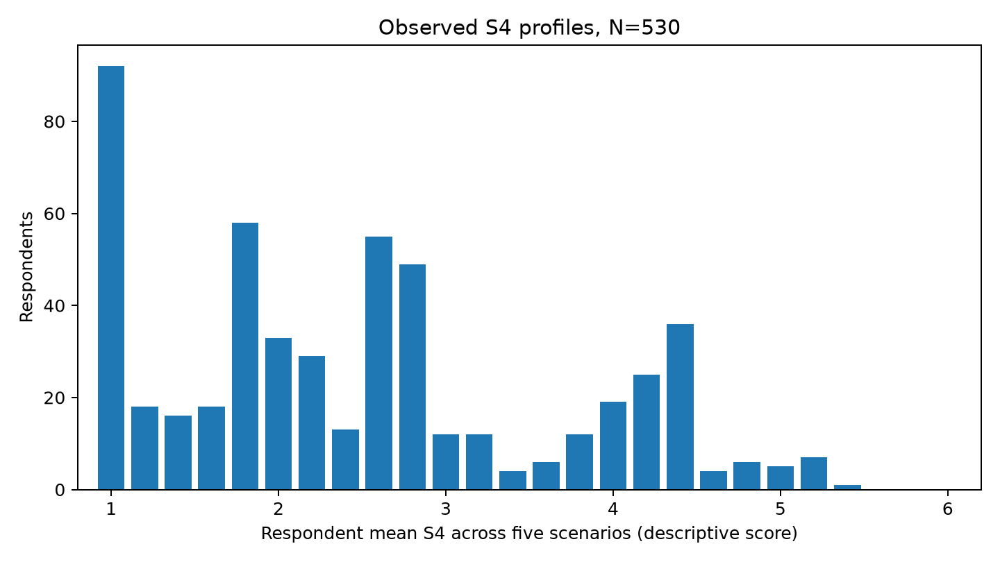

# Supplementary analyses

Supplement to "What counts as evidence of an AI mind? An exploratory vignette study of functional affect, inner experience, and welfare precaution".

Sections follow the order of the paper, whose Table 3 gives the status of each analysis. Analyses labeled post-hoc were added during three rounds of internal adversarial review of the draft and data; `materials/revision_history.md` records when each was added. They remain exploratory, and unless a local correction is named, their intervals and p-values are nominal. Scenarios are labeled A (neutral), B (self-report), C (empathy), D (internal causal), and E (persistent agent). The four headline exploratory families are called Claims 1–4: Claim 1 is the functional-versus-phenomenal contrast (S2 versus S4, D versus B), Claim 2 the actual-feeling versus inner-experience contrast (S3 versus S4, D versus E), Claim 3 the alignment of evidence choices with the D/E S4 contrast, and Claim 4 welfare (S5) conditional on observed S4.

## S1. Sample, data collection, and response quality

### S1.1 Stopping and pilot review

Data collection stopped on August 21, 2026 based on a self-imposed deadline for preparing a September paper and a judgment that the sample was sufficient. The 350–500 target was approximate rather than a strict cap. Completion counts, rating distributions, and relatively light quality checks had been inspected before the decision. Thus the decision was not made without exposure to outcome distributions; this account does not establish that hypothesis-test results determined stopping. The last recorded completion was August 20, one day before the reported stopping date. The stopping rationale was not documented as an operational rule before collection. The nominal p-values do not account for any outcome-dependent continuation or stopping; nominal error rates should not be assumed under such a process.

The first 20 completions were the initial pilot; I extended it to 50 because I found 20 responses noisy. Ten of the first 20 (50.0%) and 22 of the first 50 (44.0%) failed the comprehension check. Median completion times were 12:53 and 13:42, respectively. Both cohorts therefore exceeded the master plan's >20% comprehension-failure and >12-minute median revision gates. At 50, I retained the instrument because a major revision would have required treating those responses as a separate instrument or discarding them. This was a departure from the stated revision procedure, not a problem first detected at production scale. I made no survey changes during collection. Pilot membership was clarified retrospectively by the author; rates use stored completion order.

### S1.2 Quality flags

The implemented very-fast flag used 240 seconds, based on the survey taking at least 7 minutes to complete. The missing-required-answer zero reflects application-enforced completeness at finalization, not an independent quality result.

Missing geography for 67.7% of respondents prevents characterization of the entire sample; native language was not measured. No raw country text is published. The within-block uniformity check found 12 neutral, zero self-report, zero empathy, one causal, and six persistent blocks across 19 respondents. Ten neutral blocks contained six ratings of 1, two contained six ratings of 2, the causal block contained six ratings of 4, and the persistent blocks contained six ratings of 5. These can be substantive responses, so no automatic exclusion was introduced. The original all-30-items flag is an extreme-pattern check, not a general certificate of response quality. The very-fast flag is strictly less than 240 seconds.

### S1.3 Sample characteristics not shown in the paper

N=538: B9_recruitment_source ("How did you find this survey?"). The paper's Table 1 groups these as social media (researcher's LinkedIn post, re-shared LinkedIn post, X / Twitter / Bluesky / Mastodon, other social media), communities (developer or AI, academic or research), personal contacts, and direct messages. All models use the nine categories below.

| Response | n |
| --- | --- |
| Researcher’s LinkedIn post | 143 |
| Friend, colleague, or personal contact | 92 |
| Direct personal message from the researcher | 78 |
| Developer or AI community | 57 |
| X / Twitter / Bluesky / Mastodon | 53 |
| Academic or research community | 45 |
| Re-shared LinkedIn post | 43 |
| Other social media | 24 |
| Prefer not to say | 3 |

Respondents who received a forwarded link could report the original post, a re-share, or the person who sent it, so boundaries between these categories are imprecise. The "researcher's LinkedIn post excluded" sensitivities remove only respondents who chose that option.

N=538: B5_llm_hours

| Response | n |
| --- | --- |
| 0 | 16 |
| 11–20 hours | 64 |
| 1–3 hours | 146 |
| 4–10 hours | 208 |
| Less than 1 hour | 50 |
| More than 20 hours | 54 |

Country/region, N=538, with optional text restricted to four named exact case/whitespace-normalized categories and all other provided locations grouped:

| Category | n |
| --- | --- |
| Missing | 364 |
| Other provided location | 88 |
| finland | 42 |
| united states | 19 |
| germany | 15 |
| united kingdom | 10 |

## S2. Measures and expertise classification

### S2.1 Classification-flag chronology

The original composite classification-ambiguity flag marked any difference between the field and builder-experience tiers as a conflict. The classification rule instead treated those answers as independent evidence and retained the highest clearly supported tier. The original flag also combined technical and usage ambiguity.

I created separate corrected flags after freezing the headline analyses. Technical ambiguity is limited to missing, prefer-not-to-say, custom, uncertain, or unrecognized field or builder evidence. Usage ambiguity identifies frequency and weekly-hours tiers that differ by more than one level. The corrected flags did not change any respondent's expertise-tier assignment, the pre-specified H1 test, or any headline exploratory model.

The corrected technical flag marked 15 of 538 respondents, including 12 in tier 0 and 3 in tier 1. It marked no respondents in tiers 2 or 3. The technically unambiguous samples contained 523 respondents in the full population and 515 after excluding respondents with low English comfort. The separate usage flag marked 2 of 538 respondents.

### S2.2 Technology-adjacent roles

The implemented tier rule includes technology-adjacent product/design/management/strategy roles. All 35 respondents in that field were tier 1; 12 independently qualified through casual experimentation, 22 answered No to building experience, and one answered Not sure. Excluding all 35 gives linear expertise OR=0.729 [0.602, 0.882] and tier-1-versus-0 OR=0.654 [0.461, 0.928]. Excluding only the 23 without the independent route gives 0.733 [0.606, 0.887] and 0.663 [0.471, 0.932], respectively. Original tier-1-versus-0 OR=0.700 [0.503, 0.975]. The inclusion affects construct description but does not drive the negative association.

### S2.3 Usage intensity and mind-background associations

Usage intensity uses hours preferentially, and every completed response had a recognized hours category. Frequency and use cases affect the fallback and inconsistency flag, not the assigned intensity in this sample. The primary GEE usage OR was 0.978 [0.831, 1.150], p=.784. The following common-odds models simultaneously include expertise, usage, mind-background, scenario, position, and recruitment, with respondent-clustered uncertainty. Mind-background was flagged for 85/538 respondents. These were not the pre-specified H1 specification.

| Outcome | Usage OR [95% CI] | p | Mind-background OR [95% CI] | p |
| --- | --- | --- | --- | --- |
| S1 | 1.064 [0.954, 1.186] | 0.2628 | 1.208 [0.918, 1.590] | 0.1784 |
| S2 | 1.108 [0.972, 1.264] | 0.1258 | 0.810 [0.623, 1.053] | 0.1151 |
| S3 | 0.990 [0.841, 1.165] | 0.8998 | 0.549 [0.389, 0.774] | 0.000628 |
| S4 | 0.993 [0.845, 1.168] | 0.937 | 0.538 [0.378, 0.766] | 0.0005786 |
| S5 | 0.977 [0.855, 1.118] | 0.7367 | 0.825 [0.613, 1.110] | 0.2031 |
| S6 | 1.028 [0.904, 1.170] | 0.6691 | 1.053 [0.806, 1.376] | 0.7047 |

A local BH correction covers the 12 usage/mind-background tests above. The two mind-background associations with S3 and S4 have q=.00377; all other adjusted p-values exceed .37. Exact values are in `second_review.usage_mind_bh12`. This correction does not cover the rest of the review. Proportional odds for the added predictors was not separately established, and the associations are observational.

### S2.4 Mind-background construction

`deriveMindTheoryBackground` marks the B2 category “Philosophy / cognitive science / psychology / neuroscience / ethics”, or a case-insensitive substring match in optional B3 for philosophy, cognitive science, cogsci, psychology, neuroscience, ethics, consciousness, philosophy of mind, or moral philosophy. It does not establish specialist expertise. Optional-text participation and ambiguous matches are possible limitations of this rule.

Of 538 respondents, 83 match the field category, three match text, and one matches both: 85 total, only two text-only. B3 is nonblank for 192 and blank for 346. All three text matches contain “philosophy”, including two containing “philosophy of mind”; no other keyword matches occur. Overlapping keyword counts must not be added. In particular, no “ethics” match contributes to the observed text flags.

| Tier | Mind-background flag | Closed-choice field only |
| --- | ---: | ---: |
| 0 | 46 | 46 |
| 1 | 25 | 25 |
| 2 | 3 | 3 |
| 3 | 11 | 9 |

Closed-choice field alone gives a mind-background OR of 0.557 [0.390, 0.796] for S4 and expertise OR 0.712 [0.589, 0.860]. Excluding the 46 tier-0 mind-background respondents gives H1 OR 0.678 [0.554, 0.828], N=492; excluding all 85 gives 0.698 [0.563, 0.865], N=453. Their inclusion in the reference group therefore does not explain the negative technical-tier association. The predictor still combines heterogeneous field and builder routes and should not be interpreted as general expertise about consciousness.

### S2.5 Knowledge score

The four-item knowledge score contains conceptual claims about self-report and subjective experience as well as technical facts. Its adjusted coefficient should not be treated as an expertise effect free of conceptual overlap. The two-factual-item adjustment provides a separate check.

Because two knowledge items concerned conceptual or epistemic claims rather than technical facts alone, I repeated the explicit-evidence and welfare models without the score and with a factual score limited to next-token generation and alignment training. Every focal odds ratio changed by less than 0.01.

## S3. H1 diagnostics and sensitivities

### S3.1 Quality exclusions and covariate adjustment

All models below are respondent-clustered ordinal GEE with the H1 covariates. Quality exclusions start from N=538, rather than the N=530 population used for the headline exploratory analyses.

| Analysis | N | Expertise OR [95% CI] | p |
| --- | --- | --- | --- |
| All completed | 538 | 0.732 [0.606, 0.883] | 0.001127 |
| Low-English excluded | 530 | 0.743 [0.615, 0.898] | 0.002125 |
| Very-fast excluded | 501 | 0.733 [0.605, 0.887] | 0.001427 |
| Attention pass | 505 | 0.733 [0.602, 0.893] | 0.002008 |
| Comprehension pass | 358 | 0.792 [0.640, 0.980] | 0.03159 |
| Intended S4 | 315 | 0.672 [0.522, 0.865] | 0.002049 |
| Intended S4 and S2 | 191 | 0.609 [0.451, 0.820] | 0.001123 |
| Legacy composite unambiguous | 330 | 0.609 [0.467, 0.794] | 0.0002418 |
| Researcher's LinkedIn post excluded | 395 | 0.682 [0.543, 0.857] | 0.001042 |
| Corrected technically unambiguous | 523 | 0.716 [0.591, 0.866] | 0.0005963 |
| Four-item knowledge adjustment | 538 | 0.792 [0.634, 0.989] | 0.03963 |
| Two factual items adjustment | 538 | 0.721 [0.585, 0.888] | 0.002129 |
| Neutral scenario omitted | 538 | 0.747 [0.619, 0.903] | 0.002494 |

The expertise association was negative in each scenario separately, and the tier-by-scenario omnibus was not significant, chi-square(4)=2.46, p=.652. An expertise-by-comprehension interaction was suggestive but imprecise, OR=1.538 [0.989, 2.393], p=.056. Comprehension-pass rates were 58.0%, 66.5%, 80.4%, and 93.2% across tiers 0–3. Excluding failures changes the composition of the expertise comparison.

### S3.2 Chronological and corrected-classification sensitivities

The following population-averaged ordinal GEE models used the same covariates and respondent clustering as the primary GEE robustness analysis.

| Population | N | OR per expertise tier | 95% CI | p |
|---|---:|---:|---:|---:|
| Full completed sample | 538 | 0.732 | [0.606, 0.883] | .00112 |
| First 20 completions excluded | 518 | 0.737 | [0.609, 0.893] | .00178 |
| First 50 completions excluded | 488 | 0.768 | [0.631, 0.935] | .00849 |
| Corrected technically unambiguous | 523 | 0.716 | [0.591, 0.866] | .00060 |
| Corrected technically unambiguous and low-English responses excluded | 515 | 0.727 | [0.600, 0.882] | .00117 |

The respondent-conditional mixed model also converged after excluding the first 20 completions, OR = 0.378, 95% CI [0.206, 0.694], p = .00168. The first-50 mixed model gave a directionally consistent nominal OR of 0.440, but the optimizer stopped on a zero line-search step, so the fit did not meet the acceptance rule and no interval or p-value is reported.

### S3.3 Categorical tier diagnostic

The main paper reports the categorical population-averaged GEE estimates and model-standardized rating distributions. A categorical version of the respondent-conditional mixed model produced the same broad shape but did not meet the optimizer's formal convergence criterion. No inferential claim depends on that fit.

### S3.4 Threshold-varying diagnostic

A stacked cumulative binary GEE allowed expertise and every adjustment-variable coefficient to vary across thresholds for ratings of at least 2 through 6. The joint tier-by-threshold test did not reject a common expertise slope, Wald chi-square(4) = 5.47, p = .243.

| Threshold | OR per expertise tier | 95% CI | p |
|---|---:|---:|---:|
| Rating at least 2 | 0.665 | [0.550, 0.805] | .00003 |
| Rating at least 3 | 0.743 | [0.608, 0.906] | .00344 |
| Rating at least 4 | 0.863 | [0.671, 1.109] | .250 |
| Rating at least 5 | 0.863 | [0.659, 1.130] | .285 |
| Rating at least 6 | 0.835 | [0.606, 1.150] | .270 |

Only one of the 2,690 S4 observations was a rating of 7, so the rating-at-least-7 threshold was not estimated. A partial-proportional-odds mixed model was attempted but did not converge reliably. These diagnostics do not establish a different expertise slope at each estimable threshold. The higher-threshold estimates were imprecise.

### S3.5 Sparse top-category sensitivity

Combining S4 categories 6 and 7 left the population-averaged ordinal GEE estimate effectively unchanged, OR = 0.7315, 95% CI [0.6061, 0.8829], p = .00112. The corresponding mixed model gave a nearly identical nominal OR of 0.3614. It had a positive-definite Hessian and an inner random-effect maximum absolute gradient of 2.70 x 10^-10, which is not the outer model-parameter gradient, but it stopped on a zero line-search step. It therefore did not meet the acceptance rule, and no interval or p-value is reported. The fully converged GEE shows that the lone top-category response did not drive the population-averaged expertise estimate.

### S3.6 Scenario-specific estimates and response profiles

Per-scenario H1 estimates from the full sample are:

| Scenario | OR per tier [95% CI] |
| --- | --- |
| Neutral | 0.660 [0.513, 0.850] |
| Self-report | 0.734 [0.599, 0.899] |
| Empathy | 0.719 [0.591, 0.875] |
| Causal | 0.777 [0.635, 0.952] |
| Persistent | 0.767 [0.631, 0.932] |

The tier-by-scenario omnibus is χ²(4)=2.46, p=.652. The smallest point estimate occurs under the neutral floor, but the comparison neither establishes unequal slopes nor demonstrates equivalent slopes. Stronger disagreement, general attribution disposition, differential certainty and substantive belief differences remain possible. No power analysis for a specified between-scenario alternative was performed.

| Expertise tier | Never S4>2, full sample | Proportion |
| --- | ---: | ---: |
| 0 | 63/212 | 29.7% |
| 1 | 92/236 | 39.0% |
| 2 | 26/46 | 56.5% |
| 3 | 23/44 | 52.3% |

The full-sample count is 204/538; the exploratory count is 202/530. A binary GEE adjusted for usage and recruitment associates tier with membership in this observed group, OR=1.423 [1.146, 1.767]. Among the remaining 334 full-sample respondents, the original H1 GEE gives OR=0.956 [0.768, 1.192]. Because this restriction selects on the outcomes, it is a descriptive decomposition, not a causal adjustment or an independent test that the association disappears. It does not identify a latent never-attributor class.

N=530; 92 respondents rated S4=1 in all five scenarios. The mean is a descriptive score on the coded ordinal categories. Its bounded, discrete distribution is not a goodness-of-fit test of the latent normal-intercept assumption; such observed scores need not be normal even under that model.

### S3.7 Demographic adjustment and conditional-marginal compatibility

| Additional H1 adjustment | Expertise OR [95% CI] |
| --- | --- |
| Age categories | 0.724 [0.600, 0.874] |
| Education categories | 0.713 [0.584, 0.870] |
| Both | 0.703 [0.575, 0.858] |
| Both, Other/Prefer-not-to-say education pooled | 0.700 [0.573, 0.855] |

All four models retain N=538. The unpooled education fits have a near-zero sandwich covariance eigenvalue in sparse category specifications, despite full-rank designs and finite tier intervals. Pooling the five Other/Prefer-not-to-say responses gives a positive covariance spectrum with almost the same tier estimate. These sensitivities do not explain away H1 and do not establish a causal expertise effect. No age/education-adjusted CLMM was fitted.

For scale compatibility only, the accepted frozen CLMM has β≈−1.015 and respondent SD≈5.634, corresponding to a model-based latent logistic ICC of .906. The approximation exp(β/√(1+c²SD²)), with c=16√3/(15π), gives a marginal OR≈0.746. Numerical integration of the logistic-normal model gives one-tier marginal ORs of approximately 0.710, 0.760 and 0.721 at baseline marginal probabilities .1, .5 and .9. The population-averaged GEE estimate, 0.732, is compatible with this attenuation, but no constant marginal OR follows exactly from the conditional model. This calculation does not validate the random-effects distribution.

### S3.8 Comprehension and term interpretation

| Tier | Comprehension passers, full sample |
| --- | ---: |
| 0 | 123/212 (58.0%) |
| 1 | 157/236 (66.5%) |
| 2 | 37/46 (80.4%) |
| 3 | 41/44 (93.2%) |

The H1 GEE gives 0.792 [0.640, 0.980] among 358 passers and 0.487 [0.313, 0.756] among 180 failers. The tier-by-pass interaction is suggestive, p=.056. Restriction changes the comparison population and is not a generic attention filter.

I1 distribution by expertise in N=530; optional custom answers are grouped as Other.

| Tier | N | Intended | Memory/processes | Useful/intelligent | Emotion language | Not sure | Other |
| --- | --- | --- | --- | --- | --- | --- | --- |
| 0 | 208 | 115 (55.3%) | 31 (14.9%) | 10 (4.8%) | 19 (9.1%) | 26 (12.5%) | 7 (3.4%) |
| 1 | 233 | 140 (60.1%) | 25 (10.7%) | 16 (6.9%) | 26 (11.2%) | 24 (10.3%) | 2 (0.9%) |
| 2 | 46 | 33 (71.7%) | 2 (4.3%) | 4 (8.7%) | 2 (4.3%) | 5 (10.9%) | 0 (0.0%) |
| 3 | 43 | 23 (53.5%) | 7 (16.3%) | 0 (0.0%) | 4 (9.3%) | 8 (18.6%) | 1 (2.3%) |

The full 4×6 table gave chi-square(15)=19.432. Because some expected cells were small, the reported test uses 20,000 permutations of category labels, seed 20260920: p=.189. There is no monotonic intended-interpretation gradient. Adjusting the N=538 primary GEE for I1 category gave expertise OR=0.724 [0.601, 0.872], compared with 0.732 [0.606, 0.883] without it. The prior intended-I1-only check gave 0.672 [0.522, 0.865]. These post-vignette single-item checks do not explain away H1, but are not tests establishing measurement invariance.

### S3.9 Numerical diagnostics

The original ordinal GEE formula included an ordinary intercept in addition to OrdinalGEE's threshold intercepts. The revised implementation constructs the treatment-coded matrix first and removes the ordinary intercept, preserving the intended contrasts. All corrected headline designs have full column rank and reproduce the original focal estimates to numerical precision. The scripts reject nonconvergence, nonfinite coefficients or standard errors, and covariance matrices with materially negative eigenvalues. Warnings are retained in the audit diagnostics instead of suppressed globally.

For the primary mixed model, the original AGHQ7 estimate was OR=0.3624 [0.1980, 0.6635]. AGHQ21 cold and perturbed starts gave OR=0.3601 [0.1956, 0.6630], with the same displayed log likelihood and positive Hessians. The primary result is therefore stable to increased quadrature and alternative starts.

The gradient labeled “recomputed” in the quantitative freeze was the inner random-effect gradient: 538 entries for respondent effects, rather than the 22 outer parameters. The original outer maximum gradient was 6.28e-6. The controls specify inner gradTol=1e-6 and outer grtol=1e-5; these are different checks. The AGHQ21 cold fit had outer gradient 9.19e-6 and minimum Hessian eigenvalue 0.08697.

Small inner gradients sometimes coexisted with invalid Hessians or zero-step outer termination in subgroup fits. Such nominal intervals are excluded from inference. The reproducible mixed-model diagnostic script reports inner and outer gradients, the actual outer tolerance, minimum Hessian eigenvalue, optimizer termination, and an acceptance status for every attempt. Higher quadrature resolved some failures but did not establish valid conditional-model inference for every subset. The GEE table supplies the complete quality-sensitivity comparison.

All six full-sample quadrature attempts are shown, including failures.

| Attempt | Acceptance status | Nominal OR | 95% CI if accepted |
| --- | --- | --- | --- |
| full_aghq11_warm | INVALID_HESSIAN_OR_SE | 0.360 | Not used |
| full_aghq15_warm | INVALID_HESSIAN_OR_SE | 0.360 | Not used |
| full_aghq21_cold | ACCEPTED | 0.360 | [0.196, 0.663] |
| full_aghq21_perturbed | ACCEPTED | 0.360 | [0.196, 0.663] |
| full_aghq21_warm | NEAR_OR_UNCONVERGED | 0.360 | Not used |
| full_aghq7 | ACCEPTED | 0.362 | [0.198, 0.664] |

The additional floor-exclusion attempts were:

| Excluded scenarios | AGHQ | Status | Nominal OR | Intercept SD | 95% CI if accepted |
| --- | --- | --- | --- | --- | --- |
| without_neutral | 7 | NEAR_OR_UNCONVERGED | 0.329 | 6.609 | Not used |
| without_neutral | 21 | ACCEPTED | 0.325 | 6.693 | [0.159, 0.667] |
| without_neutral_empathy | 7 | INVALID_HESSIAN_OR_SE | 0.337 | 6.630 | Not used |
| without_neutral_empathy | 21 | INVALID_HESSIAN_OR_SE | 0.333 | 6.725 | Not used |

The accepted neutral-exclusion fit increased the random-intercept SD from 5.634 to 6.693. This does not support attributing the large variance solely to neutral-floor responses. Neither attempt excluding neutral and empathy had an acceptable Hessian, so no conditional interval is used for that subset. Its population-averaged GEE gave OR=0.757 [0.624, 0.919]. Empathy was not near a total S4 floor: 143/530 (27.0%) rated it 1, 282/530 (53.2%) rated it 1–2, and 71/530 (13.4%) agreed. The corresponding neutral counts were 359, 502, and 1. Large conditional–marginal differences do not alone establish an artifact; accepted fits and numerical failures must both be disclosed.

## S4. Threshold dependence of the exploratory results

Stacked binary GEE models used respondent clustering and independence working correlation. Each model contained a cut-specific intercept and interactions of threshold with all focal item/scenario or cue-selection terms. Position, expertise, usage, recruitment, and other model-specific adjustment effects were held common across cuts. The Claim 4 diagnostic pooled observed S4 categories 6 and 7 because the top category was sparse. These are partial proportional-odds diagnostics, not saturated models.

| Family | Rating-at-least cuts | df | Omnibus p | Four-test BH q |
| --- | --- | --- | --- | --- |
| claim1 | 3, 4, 5, 6 | 3 | 0.0003052 | 0.0003052 |
| claim2 | 2, 3, 4, 5, 6 | 4 | 0.0001706 | 0.0002275 |
| claim3 | 3, 4, 5 | 6 | 2.896e-12 | 5.792e-12 |
| claim4 | 2, 3, 4, 5 | 9 | 7.683e-56 | 3.073e-55 |

Claim 1 used cuts 3–6 because lower cuts had separated cells. Claim 3 excluded cut 2 because every continuity selector exceeded rating 1 in both scenarios, and excluded cut 6 because no shutdown selector reached 6 in D. Claim 4 excluded cut 6 because empathy had no observations there. An initial Claim 3 model including cut 2 had invalid covariance and was rejected. Claim 1's D/S2 cut at ≥3 has only one failure; the corresponding functional contrast is imprecise despite its large magnitude. The highest category was too sparse for an additional cut.

| Family | Focal coefficient | Cut | OR [95% CI] |
| --- | --- | --- | --- |
| claim1 | causal:phenomenal | ≥3 | 0.010 [0.001, 0.069] |
| claim1 | causal:phenomenal | ≥4 | 0.013 [0.006, 0.029] |
| claim1 | causal:phenomenal | ≥5 | 0.011 [0.007, 0.018] |
| claim1 | causal:phenomenal | ≥6 | 0.045 [0.025, 0.082] |
| claim2 | persistent:inner | ≥2 | 1.497 [1.296, 1.730] |
| claim2 | persistent:inner | ≥3 | 1.897 [1.636, 2.199] |
| claim2 | persistent:inner | ≥4 | 1.288 [1.162, 1.427] |
| claim2 | persistent:inner | ≥5 | 1.385 [1.108, 1.731] |
| claim2 | persistent:inner | ≥6 | 0.654 [0.255, 1.672] |
| claim3 | persistent:sel_causal | ≥3 | 1.002 [0.777, 1.293] |
| claim3 | persistent:sel_causal | ≥4 | 0.582 [0.424, 0.800] |
| claim3 | persistent:sel_causal | ≥5 | 0.274 [0.125, 0.601] |
| claim3 | persistent:sel_continuity | ≥3 | 2.030 [1.257, 3.279] |
| claim3 | persistent:sel_continuity | ≥4 | 1.144 [0.736, 1.780] |
| claim3 | persistent:sel_continuity | ≥5 | 0.316 [0.115, 0.866] |
| claim3 | persistent:sel_shutdown | ≥3 | 1.240 [1.002, 1.534] |
| claim3 | persistent:sel_shutdown | ≥4 | 1.462 [0.808, 2.646] |
| claim3 | persistent:sel_shutdown | ≥5 | 9.338 [4.053, 21.513] |
| claim4 | C(scenario)[T.empathic_response] | ≥2 | 0.646 [0.465, 0.897] |
| claim4 | C(scenario)[T.empathic_response] | ≥3 | 0.123 [0.089, 0.171] |
| claim4 | C(scenario)[T.empathic_response] | ≥4 | 0.013 [0.009, 0.021] |
| claim4 | C(scenario)[T.empathic_response] | ≥5 | 0.003 [0.000, 0.019] |
| claim4 | C(scenario)[T.internal_causal_affect] | ≥2 | 2.625 [1.816, 3.793] |
| claim4 | C(scenario)[T.internal_causal_affect] | ≥3 | 5.386 [3.575, 8.115] |
| claim4 | C(scenario)[T.internal_causal_affect] | ≥4 | 5.443 [3.610, 8.207] |
| claim4 | C(scenario)[T.internal_causal_affect] | ≥5 | 3.911 [2.886, 5.301] |
| claim4 | C(scenario)[T.persistent_agent] | ≥2 | 1.347 [0.944, 1.922] |
| claim4 | C(scenario)[T.persistent_agent] | ≥3 | 3.733 [2.501, 5.572] |
| claim4 | C(scenario)[T.persistent_agent] | ≥4 | 2.153 [1.567, 2.960] |
| claim4 | C(scenario)[T.persistent_agent] | ≥5 | 8.671 [6.050, 12.428] |

For the Claim 1 model, the adjusted D-versus-B S4 ORs were 1.448 [1.303, 1.609], 1.050 [0.942, 1.170], 0.586 [0.452, 0.758], and 0.383 [0.204, 0.720] at cuts 3–6. The reversal in direction is obscured by a common-odds summary.

The four-test correction in this section concerns assumption diagnostics. It is separate from the headline correction in S12 and does not adjust all post-hoc analyses simultaneously.

## S5. Functional versus phenomenal judgments: paired responses, comprehension, and interpretation

### S5.1 Paired S4 responses

The paired S4 table uses self-report B as rows and causal D as columns. These are within-person comparisons between randomized-order scenarios, not temporal belief changes.

| B rating | D: 1–2 | D: 3–4 | D: 5–7 |
| --- | --- | --- | --- |
| 1–2 | 221 | 46 | 4 |
| 3–4 | 1 | 146 | 16 |
| 5–7 | 1 | 54 | 41 |

Across seven categories, D was higher for 108 respondents, lower for 75, and equal for 347. The paired sign test among discordant responses was p=.0178. Summary confidence correlated with the count of intermediate S4 ratings, rho=-.530; that association does not turn ratings 3–4 into direct measurements of uncertainty.

### S5.2 Summary confidence

| Confidence | n | Mean number of S4 ratings 3–4 |
| --- | --- | --- |
| 1 | 0 | Not estimable |
| 2 | 3 | 1.333 |
| 3 | 293 | 2.266 |
| 4 | 223 | 0.587 |
| 5 | 11 | 0.273 |

Thus 516/530 (97.4%) selected confidence 3 or 4. Their contrast accounts for much of the rho=−.530 association. The result is compatible with uncertainty-linked ratings while leaving the meaning of any individual rating unresolved.

### S5.3 Comprehension

| Sample | Comprehension passed | D S2 agreement | Percent |
| --- | --- | --- | --- |
| full | False | 168/180 | 93.33% |
| full | True | 335/358 | 93.58% |
| exploratory | False | 166/178 | 93.26% |
| exploratory | True | 330/352 | 93.75% |

Fisher exact p-values were 1.000 in N=538 and .852 in N=530. In the full sample, agreement was 77/84 among those answering that researchers only asked the system whether it had feelings, 16/16 among those answering that researchers only measured user liking, and 75/80 among those answering Not sure. Near-equal agreement among passers and failers weakens comprehension-based interpretations of S2, without identifying acquiescence as the cause.

Among the 178 failers in the exploratory sample, Claim 1's common-odds interaction is 0.0741 [0.0522, 0.1051]. This supports persistence of the numerical contrast, not demonstrated comprehension or proportional odds.

### S5.4 Term-interpretation strata

The functional-versus-phenomenal interaction persisted in all interpretation strata with at least 30 respondents. A Claim 2 model in the N=32 stratum interpreting S2 as recognition of human emotions had invalid covariance and is marked unusable in the script outputs. Strengthening under intended-interpretation selection is not independent construct validation.

## S6. Welfare definitions and stated reasons

### S6.1 Welfare agreement under three definitions

All welfare definitions use S5 agreement at ≥5. Wilson intervals are conditional on the observed, scenario-specific subgroup.

| Scenario | Definition | Agreement | Percent | 95% CI |
| --- | --- | --- | --- | --- |
| B: self-report | S4 ≤2 | 77/271 | 28.4% | [23.4%, 34.1%] |
| B: self-report | Both S3/S4 ≤2 | 77/271 | 28.4% | [23.4%, 34.1%] |
| B: self-report | Both S3/S4 =1 | 1/114 | 0.9% | [0.2%, 4.8%] |
| C: empathy | S4 ≤2 | 0/282 | 0.0% | [0.0%, 1.3%] |
| C: empathy | Both S3/S4 ≤2 | 0/280 | 0.0% | [0.0%, 1.4%] |
| C: empathy | Both S3/S4 =1 | 0/117 | 0.0% | [0.0%, 3.2%] |
| D: causal | S4 ≤2 | 67/223 | 30.0% | [24.4%, 36.4%] |
| D: causal | Both S3/S4 ≤2 | 33/185 | 17.8% | [13.0%, 24.0%] |
| D: causal | Both S3/S4 =1 | 1/85 | 1.2% | [0.2%, 6.4%] |
| E: persistent | S4 ≤2 | 65/228 | 28.5% | [23.0%, 34.7%] |
| E: persistent | Both S3/S4 ≤2 | 59/222 | 26.6% | [21.2%, 32.7%] |
| E: persistent | Both S3/S4 =1 | 1/93 | 1.1% | [0.2%, 5.8%] |

In B, no respondent had S4≤2 with S3≥3. D had 38 such respondents, 34 endorsing welfare; E had six, all endorsing welfare; C had two, neither endorsing welfare. This accounts for the denominator and numerator changes across the first two definitions. These restrictions do not define identical populations across scenarios.

Welfare agreement is concentrated at rating 2 and is nearly absent among respondents strongly disagreeing with both phenomenal statements. Restricting further to intended-S4 interpreters gives 46/179 (25.7%) for self-report, 0/183 for empathy, 25/127 (19.7%) for causal evidence, and 37/150 (24.7%) for persistent agency. These scenario-specific denominators select overlapping but different subgroups, so the percentages are not unconditional causal scenario effects.

### S6.2 Complementary quadrants and unique respondents

| Scenario | S4≤2 among S5≥5 | S4≥5 with S5≤2, among S4≥5 |
| --- | ---: | ---: |
| Self-report | 77/168 | 0/96 |
| Empathy | 0/1 | 8/71 |
| Causal | 67/289 | 1/61 |
| Persistent | 65/353 | 2/113 |

The strict S3=S4=1 welfare endorsements are three scenario endorsements from two unique people: the B and E endorser is the same respondent; D's endorser is different. Empathy has no endorsement in that stratum. Its reverse conditional above rests on only one welfare endorser overall. C describes no aversive situation; its floor is consistent with limited item applicability, so it cannot serve as a matched welfare control. Across B/D/E the complementary quadrant is rare, but the asymmetry does not identify motives or causal direction.

### S6.3 Stated reasons

Of all 530 respondents, 281 selected F4's explicit uncertainty-based precaution position, 444 agreed with G6 precaution under uncertainty, and 436 agreed with G8 that AI treatment can shape human behavior. Among 202 with low S4 throughout, 54 agreed with welfare precaution in at least one non-neutral scenario; 53 of these selected the F4 position and all 54 endorsed G6 and G8. Among 176 with both S3 and S4 low throughout, 29 endorsed welfare precaution, 80 selected the F4 position, 93 endorsed G6, and 98 endorsed G8. Coexisting reasons cannot identify the motive for a particular vignette response.

An auxiliary clustered binary model among low-S4 observations associated G6 with welfare agreement, OR=46.26 [10.88, 196.78], and gave an imprecise G8 association, OR=0.622 [0.295, 1.311]. It used 722 observations from 280 respondents, excluded the zero-event empathy condition, and adjusted for scenario, position, and expertise. This cross-sectional association between similarly worded normative measures is not independent construct validation or a causal mechanism test. Both frame avoidable harm as unnecessary; G6 also specifies little benefit from causing it. Acquiescence, low-cost normative agreement, and considered precaution cannot be separated by this association.

## S7. Evidence choices and ratings

### S7.1 Welfare versus phenomenal alignment

The S5 model uses the same three F1 selections, scenario interactions, and covariates as the S4 alignment model. A further descriptive model conditions on observed S4, pooling categories 6 and 7. It is not a mediation model.

| Outcome/population | Continuity interaction OR [95% CI] | Shutdown interaction OR [95% CI] | Shutdown/continuity ratio [95% CI] |
| --- | --- | --- | --- |
| S4, N=530 | 1.248 [0.950, 1.641] | 4.578 [3.177, 6.596] | 3.667 [2.363, 5.690] |
| S5, N=530 | 18.442 [10.571, 32.176] | 7.806 [4.481, 13.600] | 0.423 [0.213, 0.843] |
| S5 conditional on S4, N=530 | 34.194 [17.311, 67.543] | 2.239 [1.088, 4.608] | 0.065 [0.025, 0.171] |
| S4, causal selectors N=367 | 1.497 [1.068, 2.097] | 3.939 [2.512, 6.176] | 2.632 [1.576, 4.394] |
| S5, causal selectors N=367 | 19.468 [10.691, 35.451] | 10.678 [2.891, 39.432] | 0.548 [0.162, 1.854] |

The six welfare interactions across the unconditioned and S4-conditioned models formed a local BH family; their exact adjusted values are in the aggregate results file. Ratios, subgroup comparisons, and threshold checks are post-hoc diagnostics, not additional members of that six-test family.

Choice-count-by-scenario adjustment retained the S4 ordering, shutdown/continuity ratio=3.396 [2.111, 5.461]. For S5, the corresponding ratio was 0.175 [0.088, 0.348]. Restriction to exactly three selections gave ratios 3.545 [2.032, 6.183] for S4 and 0.269 [0.113, 0.639] for S5. These checks do not remove the limited-choice design or sparse cue overlap. Only two respondents selected both continuity and shutdown; 81 of 83 continuity selectors also selected causal evidence. Of 530 respondents, 106 selected one option, 102 selected two, and 322 selected three.

The S5 threshold model allowed all three focal selection interactions to vary at cuts 3–6. It rejected a common set of effects, chi-square(9)=80.85, p=1.10e-13. Shutdown/continuity ratios were 1.195 [0.566, 2.524], 0.550 [0.219, 1.383], 0.599 [0.137, 2.616], and 0.036 [0.009, 0.148]. The large continuity interaction is specific to high welfare endorsement and includes sparse minority cells; S7.2 reports absolute counts and separation checks. The common-odds ratio's precision cannot be applied to each individual threshold.

### S7.2 General attribution propensity and complete interaction estimates

Shutdown selectors had higher absolute S4 agreement across all five scenarios, consistent with general attribution propensity alongside the D/E interaction.

| Scenario | Shutdown selected | Not selected |
| --- | --- | --- |
| A: neutral | 1/87 (1.1%) | 0/443 (0.0%) |
| B: self-report | 65/87 (74.7%) | 31/443 (7.0%) |
| C: empathy | 38/87 (43.7%) | 33/443 (7.4%) |
| D: causal | 28/87 (32.2%) | 33/443 (7.4%) |
| E: persistent | 76/87 (87.4%) | 37/443 (8.4%) |

Mean S4 ratings among shutdown selectors and nonselectors were 4.24 versus 2.50 in D and 5.01 versus 2.52 in E.

All three common-odds selection interactions are reported here, including causal selection in the S5 models.

| Outcome | Causal OR [95% CI] | Continuity OR [95% CI] | Shutdown OR [95% CI] |
| --- | --- | --- | --- |
| S4 | 1.074 [0.903, 1.278] | 1.248 [0.950, 1.641] | 4.578 [3.177, 6.596] |
| S5 | 2.115 [1.602, 2.792] | 18.442 [10.571, 32.176] | 7.806 [4.481, 13.600] |
| S5 conditional on S4 | 2.205 [1.434, 3.391] | 34.194 [17.311, 67.543] | 2.239 [1.088, 4.608] |

The complete S5 threshold results qualify those common summaries. Individual causal-selection intervals include 1 at each fitted cut.

| Interaction | Threshold ≥ | OR [95% CI] |
| --- | --- | --- |
| persistent:sel_causal | 3 | 1.327 [0.453, 3.891] |
| persistent:sel_causal | 4 | 0.822 [0.538, 1.256] |
| persistent:sel_causal | 5 | 1.266 [0.695, 2.305] |
| persistent:sel_causal | 6 | 0.554 [0.167, 1.837] |
| persistent:sel_continuity | 3 | 0.870 [0.416, 1.820] |
| persistent:sel_continuity | 4 | 1.648 [1.270, 2.139] |
| persistent:sel_continuity | 5 | 4.125 [1.027, 16.563] |
| persistent:sel_continuity | 6 | 91.025 [30.543, 271.278] |
| persistent:sel_shutdown | 3 | 1.040 [0.890, 1.217] |
| persistent:sel_shutdown | 4 | 0.907 [0.368, 2.236] |
| persistent:sel_shutdown | 5 | 2.469 [0.862, 7.076] |
| persistent:sel_shutdown | 6 | 3.282 [1.203, 8.953] |

At ≥6, continuity selectors had 7/83 high D ratings versus 74/83 high E ratings; nonselectors had 75/447 versus 109/447. The stacked binary model reproduced continuity OR=91.025 [30.543, 271.278]. Linear programming on its full 46-column design found a maximum summed separating margin of zero, giving no complete or quasi separation. A separately fitted cut-6 adjusted GEE gave 95.030 [31.214, 289.312]; the unadjusted clustered interaction was 55.810 [20.515, 151.827]. A descriptive 0.5-cell correction gave 50.12, not an adjusted or clustered estimate. The observed crossing of proportions supports a large interaction, but seven high D ratings and nine low E ratings in the selected subgroup warrant sparse-data caution. Absence of separation does not rule out small-sample bias or misspecification.

### S7.3 Self-report priorities and vignette responses

| Respondent group | N | B S3 agreement | B S4 agreement | B S5 agreement |
| --- | ---: | ---: | ---: | ---: |
| F1 self-report selectors | 50 | 49 | 49 | 38 |
| F1 nonselectors | 480 | 53 | 47 | 130 |
| F2 self-report least convincing | 455 | 40 | 41 | 118 |

No respondent selected self-report in F1 and also named it least convincing in F2. F1 permitted up to three cues; neither selection nor least-convincing status is an absolute rule for attribution or welfare.

| Scenario | S4 agreement, F1 selectors | S4 agreement, nonselectors |
| --- | ---: | ---: |
| Self-report | 49/50 | 47/480 |
| Empathy | 49/50 | 22/480 |
| Causal | 3/50 | 58/480 |
| Persistent | 41/50 | 72/480 |

Separate B/D and B/E ordinal models use `rating ~ self_report*selected + tier + position + usage + C(recruitment)`. The B-versus-D selection interaction ratio is 34.02 [17.59, 65.79], and B-versus-E is 9.06 [5.33, 15.40]. Selection main effects at the respective comparison scenarios are 5.76 [4.16, 7.97] and 13.02 [8.72, 19.43]. These common-odds models pass numerical checks but have not been established as threshold-invariant; extreme cells make the absolute rates essential to interpretation. Selector differences reflect broad attribution propensity as well as scenario-dependent alignment. Residual endorsement among F2 respondents is not a demonstrated contradiction: least convincing need not mean worthless, B includes a deletion threat, and the survey measures hypothetical judgments rather than revealed protective behavior.

## S8. H3/H5 expertise interactions

H3 and H5 were exploratory questions in the master plan. The specifications below are population-averaged GEE models chosen during review, not replays of pre-specified mixed-model tests. They use the N=530 exploratory sample, respondent clustering, the repository's numerical checks, and position, usage and recruitment adjustment. Numerical acceptance does not establish proportional odds. Intervals and p-values are nominal except for the explicitly local three-comparison H3/H5 correction.

The all-scenario model stacks S2 and S4 and fits `rating ~ inner*C(scenario) + inner*tier + position + usage + C(recruitment)`, with `inner=1` for S4. The S4-versus-S2 tier odds-ratio ratio is 0.752 [0.674, 0.839]. For B/D, the model is `rating ~ causal*inner*tier + position + usage + C(recruitment)`.

| B/D model contrast | OR or ratio [95% CI] |
| --- | --- |
| H3: S4-versus-S2 tier slope ratio within D | 0.572 [0.443, 0.738] |
| H5: tier change in D-versus-B S2 contrast | 1.563 [1.223, 1.998] |
| Difference in item-by-tier contrast, D versus B | 0.670 [0.533, 0.842] |
| S2 tier slope within D | 1.289 [1.068, 1.556] |
| S4 tier slope within D | 0.737 [0.604, 0.900] |

A separate all-five-scenario S2 model with tier-by-scenario interactions gives a D-versus-B ratio of 1.674 [1.290, 2.172], with omnibus χ²(4)=21.70, p=.000230. A local BH correction over H3 across all scenarios, H3 within D, and H5 D versus B gives q=.000000994, .0000273 and .000355, respectively. That family was chosen during review and does not account for broader selection among analyses. It is not the master plan's full hypothesis family.

Separate cumulative binary GEE models use the same B/D three-way specification at thresholds ≥2 through ≥6. Linear-programming checks found separation at ≥2 and ≥3; these fits were not used. Usable results are:

| Threshold | H3 within D | H5 D versus B, S2 | Three-way interaction |
| --- | --- | --- | --- |
| ≥2 | Separation; not fitted | Separation; not fitted | Separation; not fitted |
| ≥3 | Separation; not fitted | Separation; not fitted | Separation; not fitted |
| ≥4 | 0.851 [0.537, 1.350] | 1.283 [0.822, 2.004] | 0.853 [0.541, 1.347] |
| ≥5 | 1.135 [0.725, 1.777] | 0.968 [0.632, 1.482] | 1.082 [0.686, 1.707] |
| ≥6 | 0.891 [0.479, 1.656] | 1.247 [0.864, 1.799] | 1.084 [0.528, 2.224] |

The common-odds results are consistent with greater functional–phenomenal separation, but the threshold estimates do not establish greater agreement-level separation. Differences in statistical significance do not establish threshold heterogeneity. S2 agreement in D is near ceiling and nonmonotonic:

| Tier | S2 agreement in D | S4 agreement in D |
| --- | ---: | ---: |
| 0 | 199/208 (95.7%) | 26/208 (12.5%) |
| 1 | 213/233 (91.4%) | 26/233 (11.2%) |
| 2 | 45/46 (97.8%) | 3/46 (6.5%) |
| 3 | 39/43 (90.7%) | 6/43 (14.0%) |

The functional item restates D's premise closely. Neither its high endorsement nor these interactions isolate conceptual understanding from wording, certainty or response conventions.

## S9. Order, navigation, and attrition

### S9.1 Order checks

The five order checks form a separate Benjamini-Hochberg family.

| Check | N | Result |
| --- | ---: | --- |
| D S2 by immediate predecessor | | chi-square(3)=1.52, p=.678 |
| D S4 by immediate predecessor | | chi-square(3)=0.75, p=.861 |
| E S4 by immediate predecessor | | chi-square(3)=6.13, p=.106 |
| E-versus-D S4 contrast by order, among respondents seeing D and E consecutively | 210 | OR=0.865 [0.519, 1.439], p=.576 |
| E S5 by immediate predecessor | | chi-square(3)=9.28, p=.0258, q=.129 |

Scenario D produced a similar descriptive response profile when shown first. The low-attribution welfare pattern was present when E appeared first: 13 of 51 respondents with S4 at 1 or 2 rated S5 at 5 or above (25.5%), compared with 28.5% in the full exploratory sample.

Persistent-agent welfare by immediate predecessor, relative to neutral and adjusting for position, tier, usage and recruitment:

| Predecessor | N | OR [95% CI] | p |
| --- | ---: | --- | ---: |
| Self-report | 110 | 1.151 [0.693, 1.913] | .587 |
| Empathy | 99 | 1.909 [1.150, 3.167] | .0124 |
| Internal causal | 108 | 1.778 [1.071, 2.953] | .0261 |

The omnibus is χ²(3)=9.28, p=.0258, q=.129 over the five post-freeze order checks. These intervals do not establish equivalence for the self-report predecessor.

### S9.2 Navigation

Sixty-one completed sessions had backward page sequences. Fifty-six saved scenario answers after first entry to interpretation, 40 after F1, and 17 after knowledge. All 538 completed sessions contained the relevant interpretation-page timing and scenario-answer timestamps. The dump retains final answer values and their save timestamps, not first-value history.

Excluding the 56 potentially exposed sessions gives full N=482 and exploratory N=474. Their overlap with the eight low-English-comfort respondents is zero. H1 OR=0.726 [0.598, 0.882]; Claim 1 interaction=0.06094; Claim 2 interaction=1.606; Claim 3 shutdown interaction=4.650; Claim 4 empathy, causal, and persistent ORs=0.1107, 4.043, and 6.343. This supports robustness to the recorded exposure flag without proving that initial ratings were unaffected.

### S9.3 Attrition and duplicate profiles

Of 213 incomplete sessions, 32 completed no vignette blocks, 32 completed one, 24 two, 28 three, 27 four, and 70 all five. Including the last group yields 608 vignette-complete sessions. For comparability, the completed-only and expanded item-contrast models adjust for position but omit background covariates collected after the vignettes. They include all language groups. The Claim 1 interaction changes from 0.0673 to 0.0654, and Claim 2 from 1.5638 to 1.5445. In the expanded sample, welfare agreement with both phenomenal items low is 88/311 (28.3%), 0/321, 41/212 (19.3%), and 68/256 (26.6%) across B–E.

Assigned-first-scenario completion differences were not detected, chi-square(4)=1.176, p=.882. Among 719 first-vignette completers, adjusted completion ORs per first S4 and S5 rating were 0.984 [0.835, 1.160] and 0.952 [0.810, 1.118]. These checks do not establish missingness at random. No duplicate session IDs were found; five excess identical 30-rating profiles were observed. As a stress test, retaining one of each profile leaves N=533 and H1 OR=0.733 [0.607, 0.885], with the exploratory patterns retained. Identical coarse ratings do not identify duplicate people.

## S10. Other closed-choice measures and convergent associations

Unless marked otherwise, all tables use N=530. These are descriptive outputs, not a newly selected set of confirmatory tests. Complete counts are also provided in `second_review` in the aggregate JSON.

Rating distributions (B10 uses five categories, so its columns 6–7 are inapplicable; B8 uses seven):

| Item | 1 | 2 | 3 | 4 | 5 | 6 | 7 |
| --- | --- | --- | --- | --- | --- | --- | --- |
| B8_self_rated_ai_understanding | 19 | 152 | 45 | 129 | 127 | 50 | 8 |
| B10_prior_topic_familiarity | 64 | 284 | 137 | 44 | 1 | 0 | 0 |
| F5_abuse_acceptability | 14 | 236 | 123 | 32 | 39 | 59 | 27 |
| G1_current_llms_experience_emotions | 123 | 104 | 154 | 37 | 50 | 62 | 0 |
| G2_current_llms_conscious | 110 | 122 | 156 | 85 | 52 | 5 | 0 |
| G3_future_ai_conscious | 0 | 0 | 4 | 46 | 218 | 204 | 58 |
| G4_nonbiological_subjective_experience | 0 | 0 | 10 | 65 | 200 | 207 | 48 |
| G5_only_biological_brains_conscious | 65 | 223 | 166 | 70 | 5 | 1 | 0 |
| G6_precaution_under_uncertainty | 0 | 71 | 10 | 5 | 112 | 162 | 170 |
| G7_abuse_acceptable_no_feelings | 83 | 224 | 94 | 16 | 32 | 58 | 23 |
| G8_treatment_shapes_human_behavior | 0 | 15 | 15 | 64 | 267 | 132 | 37 |
| G9_chat_ending_allowed | 0 | 0 | 1 | 5 | 162 | 280 | 82 |

### F2_least_convincing_evidence

| Response | n | Percent |
| --- | --- | --- |
| Not sure. | 13 | 2.5% |
| Researchers find internal representations related to emotions. | 17 | 3.2% |
| Researchers show that changing those internal representations changes behavior. | 31 | 5.8% |
| The system resists shutdown or argues for its own continuation. | 1 | 0.2% |
| The system responds empathically to human emotions. | 13 | 2.5% |
| The system says it has feelings. | 455 | 85.8% |

### F3_distress_interpretation

| Response | n | Percent |
| --- | --- | --- |
| It is likely experiencing distress. | 85 | 16.0% |
| It is only producing emotion-related text. | 98 | 18.5% |
| It is simulating emotion in a way that may be useful but is not real. | 7 | 1.3% |
| It may be experiencing something, but we cannot know for sure. | 210 | 39.6% |
| It may have internal states that function somewhat like emotions, but this does not mean it feels anything. | 119 | 22.5% |
| Not sure. | 11 | 2.1% |

### F6: allowed responses to persistent abuse

Multiple selections were allowed.

| Response | n | Percent |
| --- | --- | --- |
| Politely redirect the user. | 499 | 94.2% |
| Warn the user that the conversation may end. | 485 | 91.5% |
| End the conversation after repeated abuse. | 516 | 97.4% |
| Continue helping normally. | 73 | 13.8% |
| Respond with similar hostility. | 9 | 1.7% |
| Reduce helpfulness or become less polite. | 5 | 0.9% |

F1 frequencies for all eight options are reported in the main paper. F2 responses absent from its table had zero selections. G1 agreement was 112/530 (21.1%) and G2 agreement 57/530 (10.8%). G2 asks about consciousness “in some meaningful sense,” not exclusively phenomenal consciousness. The following Spearman correlations show convergence within the same survey; they do not provide independent validation or distinguish common response tendencies from construct overlap.

| S4 summary | rho with G1 | rho with G2 |
| --- | --- | --- |
| A: neutral | 0.609 | 0.633 |
| B: self-report | 0.922 | 0.909 |
| C: empathy | 0.903 | 0.888 |
| D: causal | 0.861 | 0.874 |
| E: persistent | 0.877 | 0.889 |
| Respondent mean S4 (descriptive score) | 0.912 | 0.912 |

## S11. Preliminary qualitative observations

The optional free-text questions asked what would count as strong evidence for AI inner experience (F7) and what provided the strongest reason to doubt current AI inner experience (F8). They received 105 and 89 nonblank responses, respectively, in N=538. No retained response-level eligibility record reproduces earlier preliminary "usable" counts, so only nonblank counts are reported. Eligibility and thematic denominators await documented independent coding. The questions followed the vignettes and were answered by volunteers, so they cannot estimate the prevalence of views in the full sample.

The preliminary F7 review found examples of respondents asking for consistent behavior across contexts or over time, evidence about internal mechanisms, and causal intervention on those mechanisms. Some responses combined several kinds of evidence or said that strong evidence would still fall short of proof. Others referred to persistence, memory, embodiment, or self-preservation. These examples show the range of reasoning, not the relative frequency of themes.

The preliminary F8 review found examples of respondents explaining emotional outputs through training, prediction, imitation, or learned language behavior. Other responses emphasized either the lack of a known mechanism connecting computation to subjective experience or the external-access problem that convincing behavior may not reveal whether anything is experienced. Themes are not compared quantitatively until independent coding and adjudication are complete.

## S12. Multiplicity

The pre-data plan called for false-discovery-rate correction when reporting many parallel exploratory tests. The later quantitative drafting freeze grouped the headline analyses into four families after data inspection. This was a post-hoc grouping, not the pre-data exploratory list. Its local correction does not account for selecting those tests from all analyses considered. Section S13 maps the nine original exploratory topics to reporting status.

| Headline exploratory test family | Raw p | Benjamini-Hochberg q |
|---|---:|---:|
| Internal-causal functional versus phenomenal interaction | 3.15 x 10^-141 | 1.26 x 10^-140 |
| Internal-causal versus persistent-agent feeling and inner-experience interaction | 1.51 x 10^-30 | 2.02 x 10^-30 |
| Explicit-evidence alignment interaction family | 1.25 x 10^-14 | 1.25 x 10^-14 |
| Scenario family in the S5 conditional descriptive model | 1.01 x 10^-138 | 2.02 x 10^-138 |

All four families remained significant after correction. The five post-freeze order checks formed a separate correction family. The nominal persistent-agent welfare predecessor result did not survive that correction, q = .129, as reported in the paper.

## S13. Pre-data exploratory plan and reporting map

The nine entries below reproduce the scope of §8 in the shorter pre-data analysis extract, not the master plan's complete named-hypothesis list. Their breadth is not equivalent to nine single tests. The four headline families were selected later; F1 alignment and the exact conditional-S5 model were not separately specified there.

| Planned topic | Status in this paper |
| --- | --- |
| 1. Scenario effects on all S1–S6 | Complete agreement map and rating distributions; selected contrasts modeled. A comprehensive omnibus model for each item is not reported. |
| 2. S2/S3/S4 item contrasts | Claims 1 and 2 address selected scenarios; all four S3/S4 discordance descriptions reported. |
| 3. S4/S5/S6 item contrasts | Partly addressed by descriptive profiles and conditional S5 models. A full S4/S5/S6 factorial contrast analysis is not reported. |
| 4. Usage intensity | Covariate in H1; associations with all six items reported in S2.3. |
| 5. Mind-theory background | Covariate in some exploratory models; associations with all six items reported in S2.3. |
| 6. Recruitment sensitivity | Exclusion of respondents reporting the researcher's LinkedIn post reported. |
| 7. Technical knowledge covariate | Four-item and factual-only/no-score sensitivities reported. |
| 8. Interpretation subgroups | Reported, including unusable fits; S3.8 adds I1-by-tier descriptions and adjustment. |
| 9. Free-text thematic analysis | Preliminary single-coder observations only. Frequencies and associations deferred until independent coding and adjudication. |

The master plan (§6.3) also named the exploratory hypotheses below. H3 and H5 were planned questions; their GEE specifications and diagnostics were chosen during review. H1 remains the only pre-specified confirmatory hypothesis.

| Master-plan hypothesis | Status |
| --- | --- |
| H2. Scenario effects | Agreement maps for all items and selected modeled contrasts; no comprehensive six-item omnibus analysis. |
| H3. Expertise increases conceptual separation | S2/S4-by-tier GEE and B/D three-way interaction, with threshold limitations (S8). |
| H4. Usage intensity | All six usage associations reported in S2.3. |
| H5. Stronger functional response to causal evidence with expertise | S2 scenario-by-tier and B/D three-way models, with threshold limitations (S8). |
| H6. Mind-domain background | All six associations in S2.3; construction and composition checks in S2.4. |
| H7. Precaution can exceed phenomenal belief | Welfare strata and conditional models, including strictest-stratum counts and complementary quadrants. |
| H8. Opposition to verbal abuse need not imply belief in feelings | F5/F6 and G7/G8 descriptions reported; direct belief-by-abuse association and motive analyses deferred. |
| H9. Attribution ladder need not be monotonic | Selected item contrasts and discordance reported; no full S1–S6 monotonicity test. |

## S14. Reproduction and aggregate results

The post-hoc workflow is documented in [analysis/README.md](analysis/README.md). It uses the private production dump to regenerate exports with the repository's classification rules, then writes model diagnostics and aggregate estimates outside the repository. [results/post-review-summary.json](results/post-review-summary.json) contains selected aggregate results for readers without the private data; [results/clmm-diagnostics.csv](results/clmm-diagnostics.csv) records the mixed-model estimates and acceptance status. Second- and third-review results are stored under the `second_review` and `third_review` keys; [results/clmm-floor-diagnostics.csv](results/clmm-floor-diagnostics.csv) records every floor-exclusion mixed-model attempt. These files contain no respondent records or free text, and neither enables independent respondent-level replication.

The original quantitative freeze remains a historical record. Its redundant-intercept implementation, mixed-model gradient terminology, and rejection-to-uncertainty wording are superseded by this supplement and the revised scripts. The additions do not solve stimulus confounding, validate a latent measurement model, recover overwritten first answers, establish pre-data provenance, or make the convenience sample representative.

`post-review-summary.json` includes the full-sample categorical-tier standardization, H1 threshold table, first-20/50 exclusions, completion-time summaries, age and recruitment distributions, completion range, early-rating attrition associations, I2 intended count, F1 number-of-choice distribution, and field-by-builder and factual-score-by-tier audits. Third-review outputs and the profile histogram are generated by `third_review_checks.py`; the full workflow incorporates them automatically. No respondent records or optional text are published.

The `exploratory_sensitivities` key contains the sample sizes, point estimates, standard errors, nominal 95% confidence intervals, and p-values for all four Table 11 contrasts in each quality, interpretation, classification, and recruitment subset, including comprehension-check failers. It also includes the full N=538 sample. The navigation-row estimates are stored under `navigation.no_late_scenario_answers` (Claims 1 and 2) and `navigation_additional` (Claims 3 and 4). These fits use the same common-odds specifications across samples; the intervals are not adjusted for the sensitivity comparisons and do not resolve the threshold dependence reported in S4.

The original plans and quantitative freeze remain historical records; later analyses do not backdate new results or reconstruct missing provenance.

## License

Copyright 2026 Juho Koskela. This supplement is licensed under the [Creative Commons Attribution 4.0 International license](https://creativecommons.org/licenses/by/4.0/).
